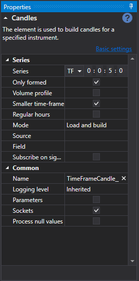

# Diseñador de estrategias

El proceso principal de diseño de una estrategia y sus elementos componentes se realiza en el panel **Scheme**, combinando bloques y líneas de conexión. El panel Scheme consta de los paneles **Palette**, **Designer** y **Properties**.

## Panel Palette

El panel **Palette** contiene bloques a partir de los cuales se crean estrategias. Todos los elementos de la paleta están divididos en categorías, descritas en la sección [Descripción de bloques](elements.md). Para añadir un bloque al panel **Designer**, haga clic con el botón derecho en el bloque requerido y, sin soltar el botón, arrástrelo al panel **Designer**. Después, el elemento se seleccionará automáticamente y sus parámetros se mostrarán en la ventana para editar las propiedades del bloque.

## Panel Designer

El panel **Designer** es donde ocurre todo el proceso de creación de una estrategia mediante la combinación de bloques y conexiones (líneas). Representa visualmente el esquema de la estrategia. La información detallada sobre la creación de una estrategia se describe en la sección [Creación de un algoritmo a partir de bloques](first_strategy.md).

## Panel Properties

El panel **Properties** muestra los parámetros del bloque seleccionado en el panel **Designer**. Cuando se selecciona un bloque en el panel **Designer**, su marco se colorea de negro.

El panel **Properties** puede mostrarse en dos modos: *Basic settings* y *Advanced settings*.

De forma predeterminada, al construir un esquema, las propiedades se muestran inicialmente en modo *basic settings*. Para cambiar al modo *advanced settings*, debe hacer clic en el título correspondiente.

En el modo *basic settings*, solo se muestran las propiedades más necesarias del bloque. Por ejemplo, para el bloque [Velas](elements/data_sources/candles.md), se mostrará el timeframe, la bandera para recibir solo velas formadas, la bandera de posibilidad de construir velas a partir de un timeframe menor y la bandera de suscripción a velas por señal.

En el modo *advanced settings*, se mostrarán todas las propiedades del bloque disponibles para cambio y configuración.

Todos los bloques contienen un conjunto de propiedades predefinidas que se hacen visibles en el modo *advanced settings*:

- **Name** – nombre del elemento mostrado en el diseñador.
- **Logging level** – nivel de registro para este elemento.
- **Parameters** – mostrar los parámetros del elemento en elementos de nivel superior.
- **Sockets** – mostrar los sockets del elemento en elementos de nivel superior.

La información detallada sobre las propiedades de cada bloque se describe en la sección [Descripción de bloques](elements.md).

## Véase también

[Descripción de bloques](elements.md)
