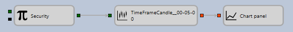

# Elementos

Dentro de cada cubo se muestra un icono que lo caracteriza, así como un nombre que puede cambiarse por uno definido por el usuario en el panel **Propiedades**. La sugerencia del cubo muestra una descripción de para qué sirve. Al seleccionar un cubo con el ratón, puede ver sus propiedades en el panel **Propiedades** y, si es necesario, cambiar algunos parámetros.

A la izquierda y a la derecha del cubo, los cuadros de color muestran los parámetros de entrada (izquierda) y salida (derecha).

Los parámetros son necesarios para llenar el cubo con información mientras la estrategia se ejecuta. Por ejemplo, para el cubo [Velas](elements/data_sources/candles.md), se pasa a la entrada el instrumento para el que se desea construir una vela, y en la salida se devuelven las velas construidas. Estas, a su vez, pueden usarse como parámetro de entrada para el elemento [Gráfico](elements/common/chart.md). O pasarse a un método que determina el tamaño de la vela.

El color denota el tipo de datos que se pasa en los parámetros. Distintos parámetros en distintos cubos pueden recibir y pasar tipos de datos distintos e incompatibles. La descripción de cada parámetro se indica en la sugerencia. Para evitar muchos errores al conectar parámetros de tipos diferentes, cada parámetro tiene su propio tipo de datos, que se diferencia por color. Para indicar los parámetros se usa el siguiente conjunto de colores:

- **Negro** – cualquier tipo de dato, normalmente usado como señal para realizar determinadas acciones dentro del elemento.
- **Verde oscuro** – el instrumento.
- **Cian oscuro** – el libro de órdenes.
- **Cian** – la cotización (un par de precio y volumen).
- **Naranja rojizo** – velas y estado de vela.
- **Dorado oscuro** – el valor del indicador.
- **Oliva** – la orden.
- **Violeta rojizo pálido** – error de orden.
- **Verde oliva oscuro** – operación propia.
- **Azul intenso** – valor de bandera (indica el estado y tiene dos valores: arriba (true) y abajo (false)).
- **Verde mar medio** – valor numérico, puede establecerse como número o porcentaje.
- **Azul pizarra oscuro** – valores que pueden compararse (por ejemplo, valor numérico, cadena, valor de indicador, etc.).
- **Marrón** – la cartera.
- **Rosa intenso** – opciones.
- **Beige** – el lado.
- **Caqui oscuro** – la operación.
- **Azul oscuro** – la estrategia.
- **Chocolate** – la fecha.
- **Coral** – la hora.
- **Marrón silla de montar** – la posición.
- **Verde chartreuse** – el estado de la orden.
- **Gris claro** – el modelo Black-Scholes.
- **Canela** – el modelo Black-Scholes de cesta.
- **Púrpura** – la cadena de texto.

Así, puede conectar parámetros de los mismos colores (los mismos tipos de datos), excepto los siguientes tipos de parámetros:

1. El parámetro **negro** puede aceptar cualquier dato. Con mayor frecuencia, estos parámetros se usan para pasar señales para cualquier acción dentro del cubo. Por ejemplo, el cubo [Variable](elements/data_sources/variable.md) almacena un valor determinado y lo envía a la salida cuando recibe una señal.
2. El parámetro **azul pizarra oscuro** puede recibir en la entrada distintos tipos de datos comparables. Por ejemplo, numéricos, valores de indicadores, cadenas, etc.

Debe tenerse en cuenta que los tipos de parámetros pueden depender de las propiedades del cubo. Por ejemplo, para el cubo [Convertidor](elements/converters/converter.md), el tipo del parámetro de entrada se determina automáticamente por el tipo de datos del cubo fuente para [Convertidor](elements/converters/converter.md). Al crear un enlace, el color del cuadrado en el elemento cambia automáticamente.

Los parámetros de salida normalmente permiten varias conexiones salientes a distintos cubos; los parámetros de entrada generalmente permiten una conexión, excepto el cubo [Combinación](elements/common/combination.md), que permite combinar el flujo de datos de distintos cubos en uno. El número de conexiones concurrentes para un parámetro se especifica en el código fuente del cubo.

Los cubos para construir esquemas se dividen en varias categorías, cada una destinada a usarse en una parte determinada del esquema.

## Contenido recomendado

[Gráfico](elements/common/chart.md)
