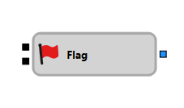

# Bandera

El componente "Flag" se usa para gestionar una bandera binaria, que puede establecerse o restablecerse según señales entrantes.

## Sockets de entrada

- **Trigger**: acepta cualquier valor excepto `False`. Establece la bandera al recibir el primer valor adecuado. Si la bandera ya está establecida, las señales posteriores se ignoran hasta que se restablezca.
- **Reset**: acepta cualquier valor excepto `False`. Restablece la bandera, permitiéndole responder a activaciones posteriores.

## Sockets de salida

- **Signal**: emite una señal cuando la bandera está establecida.
