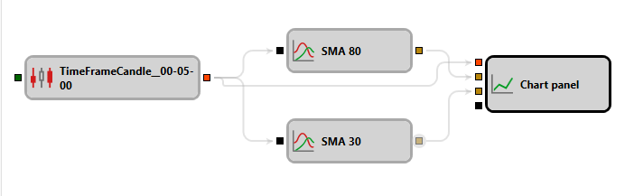

# Indicador

Este bloque se usa para calcular valores de indicadores.

## Sockets de entrada

- **Cualquier dato** – tipo específico de datos con base en el cual debe calcularse el indicador seleccionado (según el indicador, puede ser un valor numérico, una vela, etc.).

## Sockets de salida

- **Indicador** – valor calculado del indicador, que puede usarse para mostrarlo en el panel de gráfico o para cálculos posteriores.

## Parámetros

- **Tipo de indicador** - parámetro usado para seleccionar el indicador deseado, y varios parámetros adicionales que corresponden al tipo de indicador seleccionado. El conjunto de estos parámetros cambia cuando cambia el tipo de indicador seleccionado.
- **Final** - pasar solo [valores finales](../../../../../api/indicators.md) del indicador.
- **Formada** - pasar solo valores cuando el indicador está completamente [formado](../../../../../api/indicators.md).

## Véase también

[Lista de indicadores](../../../../../api/indicators/list_of_indicators.md)
[Condición lógica](logical_condition.md)
