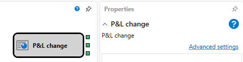

# Estrategia P&L

El elemento proporciona información de P\/L de la estrategia.

## Conectores de salida

- **P\/L no realizado** – valor numérico del beneficio\/pérdida no realizado.
- **P\/L realizado** – valor numérico del beneficio\/pérdida realizado.
- **Comisión** – valor numérico de la comisión.

## Contenido recomendado

[Valor anterior](prev_value.md)
