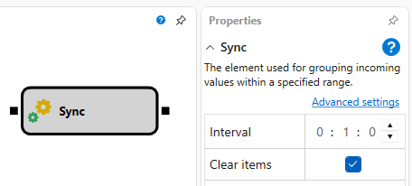
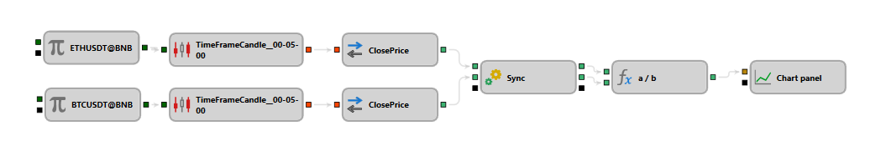

## Sincronización

El bloque Synchronization está diseñado para acumular y sincronizar datos de varias fuentes (por ejemplo, velas de distintos instrumentos, distintos marcos temporales, combinaciones de velas y transacciones) y posteriormente emitirlos cuando se acumula una cierta cantidad. Este bloque es útil para crear índices personalizados o arbitraje.

## Sockets de entrada

- **Entrada**: cuando se conecta una nueva fuente de datos, se crean automáticamente un socket de salida correspondiente y un nuevo socket de entrada. El número de valores entrantes es ilimitado.

## Parámetros

- **Intervalo**: establece el tiempo después del cual los datos deben actualizarse o eliminarse. Si llega un valor entrante con una hora que supera el valor anterior más el intervalo, los datos antiguos se limpian y comienza una nueva tanda de acumulación de datos.
- **Borrar elementos**: si esta opción está activada, los datos se limpian después de acumularse para todos los sockets de entrada conectados, o se acumulan hasta que aparezcan datos del siguiente intervalo temporal.

## Ejemplos de uso

1. Crear un índice personalizado para varias acciones, donde se deben considerar distintas series temporales de diversas fuentes de datos.
2. Arbitraje entre distintos mercados usando datos temporales sincronizados para identificar diferencias temporales de precio.

