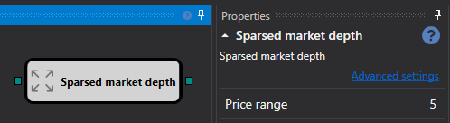

# Libro de órdenes disperso

El cubo se usa para obtener un libro de órdenes disperso para el instrumento especificado.

### Conectores de entrada

- Libro de órdenes - libro de órdenes que debe reducirse.

### Conectores de salida

- Libro de órdenes - libro de órdenes disperso.

### Parámetros

- **Rango de precios** - rango de precios, con pasos en los que se reducirá el libro de órdenes.

## Contenido recomendado

[Libro IV](../options/iv_book.md)
