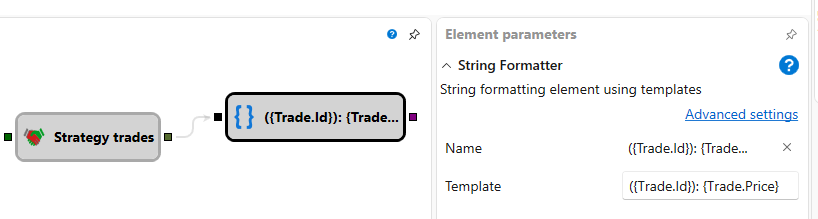

# Formato de cadena

El cubo convierte un valor entrante de cualquier tipo en una cadena de texto. La
conversión se realiza según una plantilla con marcadores de posición entre
llaves. Cada marcador se refiere al valor completo (`{0}`) o a una de sus
propiedades (`{Price}`, `{Trade.Price}`, etc.). Puede especificar un formato después de
dos puntos para controlar cómo aparecen en el texto números, fechas u otros objetos.

### Sockets de entrada

Sockets de entrada

- **Entrada** – valor que se va a formatear. El socket acepta datos de cualquier tipo.

### Sockets de salida

Sockets de salida

- **Texto** – resultado de aplicar la plantilla al valor entrante.

### Parámetros

Parámetros

- **Plantilla** – plantilla de formateo de cadenas aplicada al valor entrante. La
  plantilla predeterminada es `{0}`, lo que significa que el valor se inserta sin
  formato adicional. Los marcadores pueden contener nombres de propiedades y cadenas de formato, por
  ejemplo `Price: {0:0.00}` o `{Price:0.00}`.

### Ejemplos

- La plantilla `Price: {0:0.00}` con entrada `10.5` produce `Price: 10.50`.
- La plantilla `{Price} - {Volume}` con el objeto de operación de entrada `{ Price = 100,
  Volume = 2 }` produce `100 - 2`.
- La plantilla `{Trade.Price} - {Trade.Volume}` con el objeto de entrada
  `{ Trade = { Price = 100, Volume = 2 } }` produce `100 - 2`.
- La plantilla `Time: {Time:HH:mm:ss}` con un objeto de entrada con `Time =
  2024-05-01T09:15:00` produce `Time: 09:15:00`.

## Contenido recomendado

[Concatenación de cadenas](string_concat.md)
[Notificación](notification.md)
