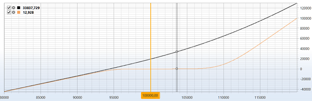

# Gráfico de posiciones

El cubo se usa para mostrar el **Chart of options positions**.

Para mostrar el **Chart of options positions**, debe añadir el componente gráfico **Chart of options positions**.

### Sockets de entrada

Sockets de entrada

- **Model** – modelo de cálculo (por ejemplo, Black-Scholes).
- **Price of the underlying asset** - precio del activo subyacente.

## Contenido recomendado

[Black-Scholes](black_scholes.md)
