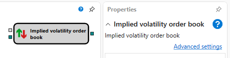

# Libro IV

El cubo se usa para calcular un libro de órdenes de volatilidad implícita.

### Conectores de entrada

Conectores de entrada

- **Modelo** – modelo de cálculo (por ejemplo, Black-Scholes).
- **Libro de órdenes** – libro de órdenes.

### Conectores de salida

Conectores de salida

- **Libro de órdenes** - valores del libro de órdenes de volatilidad implícita.

## Contenido recomendado

[Mesa de opciones](option_desk.md)
