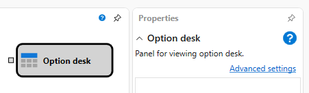
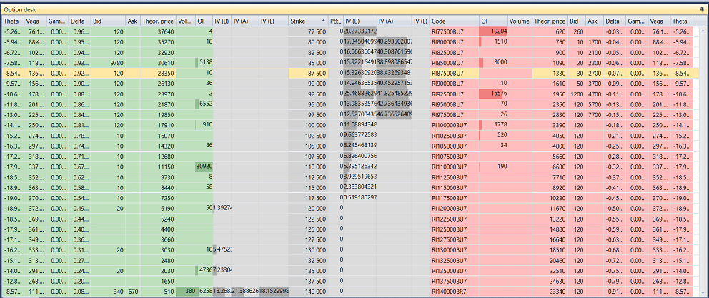

# Mesa de opciones

El cubo se usa para mostrar el option desk.

Para mostrar el **Option desk**, debe añadir el componente gráfico **Option desk**.

### Sockets de entrada

Sockets de entrada

- **Model** – modelo de cálculo (por ejemplo, Black-Scholes).

## Contenido recomendado

[Gráfico de posiciones](chart_positions.md)
