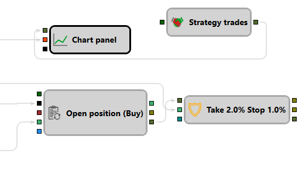

# Protección de posición

Este bloque se usa para proteger automáticamente operaciones abiertas con stop-loss y take-profit.

### Sockets de entrada

Sockets de entrada

- **Operación propia** – operación propia que debe protegerse con stop-loss y take-profit.
- **Precio** – precio actual (puede tomarse de una vela, del último tick, etc.). Es necesario para seguir el precio actual del instrumento y activar órdenes protectoras.

### Sockets de salida

Sockets de salida

- **Take-profit** – orden para fijar beneficios.
- **Stop-loss** – orden para limitar pérdidas.
- **Transacción propia** – transacción creada por una de las órdenes anteriores.

### Parámetros

Parámetros Take y Stop

- **Valor** - valor de take o stop.
- **Trailing** – si se usa protección trailing.
- **Tiempo de espera** - valor de timeout después del cual la protección se activa forzosamente al precio de mercado.
- **Órdenes de mercado** – usar órdenes de mercado (sin precio) para cerrar rápidamente la posición.

> [!WARNING]
> Las transacciones entrantes NO PUEDEN ser transacciones de toda la estrategia (bloque [Strategy Trades](../common/trades_by_strategy.md)), ya que esto provocará un cálculo incorrecto de la posición actual: las transacciones de protección también se convertirán en transacciones de la estrategia. El bloque **Protección de posición** debe recibir transacciones desde el socket de salida **Transacción** de los cubos [Registro de orden](../orders/register.md) y [Modificar posición](modify.md), o de componentes similares que cambien directamente la posición.
