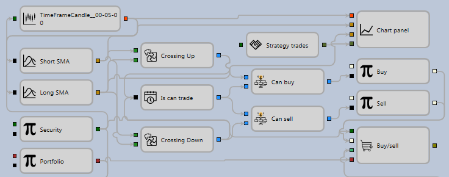

# Primera estrategia

Para crear esquemas de estrategias y elementos compuestos, y probar las estrategias obtenidas con datos históricos, puede usar un ejemplo de estrategia de media móvil (SMA). Permite recorrer un ciclo completo desde la creación de una estrategia hasta su prueba y depuración. La estrategia de media móvil (SMA) se encuentra en la carpeta **Estrategias** del panel **Esquemas**.

1. Cree una nueva estrategia a partir de cubos como se describe en [Uso de código](../using_code.md). Para añadir una nueva estrategia, haga clic en el botón **Añadir**  en la pestaña **Común** y seleccione **Estrategia**. O haga clic con el botón derecho en la carpeta **Estrategia** del panel **Esquemas** y haga clic en el botón **Añadir**  en el menú desplegable.

Después de hacer clic en el botón **Añadir**  en la carpeta **Estrategia** del panel **Esquemas**, aparecerá una nueva estrategia. En el espacio de trabajo aparece una nueva pestaña con la estrategia; al cambiar a ella, la pestaña **Emulación** se abrirá automáticamente en la cinta. En la pestaña **Emulación**, puede cambiar el nombre de la estrategia y darle una breve descripción.

2. Para trabajar cómodamente, abra y fije los paneles **Paleta** y **Propiedades** del área **Esquemas** haciendo clic en el botón . El resultado será una ventana del siguiente tipo.

3. La esencia de la estrategia de media móvil (SMA) es la siguiente:

- Hay dos medias móviles con distintos períodos de cálculo: una SMA larga y una SMA corta. En el ejemplo, el cubo [Indicador](elements/common/indicator.md) de la SMA larga se llama Long SMA y tiene un período de 80 velas; la SMA corta se llama Short SMA y tiene un período de 10 velas.
- Cuando una media móvil corta cruza una larga de abajo hacia arriba, se abre una posición larga.
- Cuando una media móvil corta cruza una larga de arriba hacia abajo, se abre una posición corta.
- Si hay una posición opuesta en el momento de recibir una señal para abrir una posición, se revierte la posición.

4. Para todas las estrategias se necesita un instrumento y una cartera, que se usarán para las operaciones. Debe añadirlos desde el panel **Paleta** al panel **Designer**. En el ejemplo, el cubo [Variable](elements/data_sources/variable.md) con el tipo **Instrumento** se llama Instrument, y el cubo [Variable](elements/data_sources/variable.md) con el tipo **Cartera** se llama Portfolio. Marque la casilla **Parámetros** de los cubos Instrument y Portfolio. Cuando la casilla está seleccionada, el cubo tomará el valor de la configuración de la estrategia. Si no selecciona la casilla, debe introducir manualmente los valores de instrumento y cartera. Si deja vacío el campo Value del cubo [Variable](elements/data_sources/variable.md) y no marca la casilla de parámetros, durante las pruebas la estrategia generará un error por el valor no establecido del cubo [Variable](elements/data_sources/variable.md).

Si necesita usar varios instrumentos o carteras en la estrategia, para cada cubo debe desmarcar la casilla **Parámetros** y establecer el valor del instrumento o cartera.

5. Después de añadir el instrumento y la cartera, debe añadir dos cubos [Indicador](elements/common/indicator.md), seleccionar el tipo SMA, nombrar el primero Long SMA y establecer el período de 80 velas; nombrar el segundo Short SMA y establecer el período de 10 velas.

6. Para que los indicadores funcionen, páseles una serie de velas. Para ello, cree el cubo [Velas](elements/data_sources/candles.md). En el ejemplo, se usan solo velas formadas con un marco temporal de 5 minutos.

7. Después de añadir los indicadores, debe añadir dos cubos que definen los cruces de los indicadores. Estos son los cubos [Cruce](elements/common/crossing.md) de los elementos compuestos. El primer cubo se llama Crossing Up. Define el cruce de abajo hacia arriba. El indicador Short SMA se pasa a la entrada superior del cubo, y el indicador Long SMA a la entrada inferior. El operador CurrComparison se establece en un valor mayor, y el operador PrevComparison se establece en menor o igual. El segundo cubo se llama Crossing Down; define el cruce de arriba hacia abajo. El indicador Short SMA se pasa a la entrada superior del cubo, y el indicador Long SMA a la entrada inferior. El operador CurrComparison se establece en un valor menor, y el operador PrevComparison se establece en mayor o igual.

8. Añada [Gráfico](elements/common/chart.md) para mostrar visualmente velas, indicadores y operaciones. Añada al [Gráfico](elements/common/chart.md) elementos de visualización para velas, dos indicadores y operaciones.

9. Como fuente de operaciones para mostrar en el gráfico se usa el cubo **Operaciones** de la estrategia. En el ejemplo se llama Strategy trades.

10. Para abrir una posición, añada dos cubos [Registrar orden](elements/orders/register.md). El primer cubo es para comprar con una orden de mercado. A la entrada de este cubo se pasan: **Instrumento**, la señal de apertura de posición desde el cubo de cruce Crossing Up, **Cartera** y el volumen de la orden. El segundo cubo es para vender con una orden de mercado. A la entrada de este cubo se pasan: **Instrumento**, la señal de apertura de posición desde el cubo de cruce Crossing Down, **Cartera** y el volumen de la orden.

11. Al conectar los elementos anteriores con líneas ([Líneas](lines.md)), se obtiene un esquema sin tener en cuenta la posición actual de la estrategia. En tal condición, acumulará una cantidad excesiva de lotes.

Para controlar la posición, debe añadir el cubo [Posición](elements/positions/current.md), a cuya entrada se pasan **Instrumento** y **Cartera**.

Para procesar la posición actual, puede usar el esquema listo descrito en [Obtener posición actual](schema_samples/get_current_position.md). Este esquema determina el valor real del volumen de orden requerido. Si la posición debe revertirse, devuelve el doble del valor de la cartera.

12. Como resultado, la estrategia completada se ve así:

## Contenido recomendado

[Elementos compuestos](composite_elements.md)
