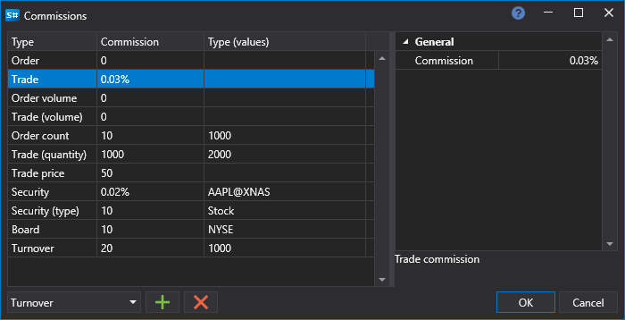

# Comisiones

En el panel [Configuración de backtesting](components/backtesting_settings.md), puede establecer la configuración de monitoreo de comisiones.

En la ventana **Comisiones**, debe seleccionar el tipo de comisión, establecer el valor de comisión y la condición bajo la cual se cobrará.

### Lista de tipos de comisión

Lista de tipos de comisión

- **Órdenes (número)** – comisión por número de órdenes.
- **Orden** – comisión por la orden.
- **Orden (volumen)** – comisión por el volumen en la orden.
- **Operación (número)** – comisión por número de operaciones.
- **Operación (precio)** – comisión por el precio de la operación.
- **Operación** – comisión por la operación.
- **Operación (volumen)** – comisión por el volumen en la orden.
- **Instrumento** – comisión del instrumento.
- **Instrumento (tipo)** – comisión del tipo de instrumento.
- **Volumen de negocio** – comisión por volumen negociado.
- **Mercado** – comisión del board.
