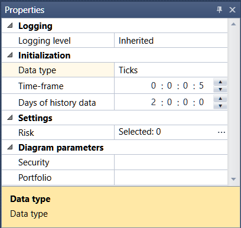

# Configuración live

El panel **Propiedades** está minimizado de forma predeterminada en el lado derecho de la pestaña de estrategia. Este panel es una tabla de propiedades de emulación o configuración Live. Cuando selecciona una propiedad concreta, aparece una descripción detallada de esta propiedad en la parte inferior de la tabla. Todas las propiedades están agrupadas:

**Registro**

- **Nivel de registro** – nivel de registro para este elemento.

**Inicialización**

- **Tipo de datos** - tipo de datos.
- **Marco temporal** - usar velas con el marco temporal especificado.
- **Días de datos históricos** - número de días de datos históricos para inicializar la estrategia.

**Configuración**

- [Gestión de riesgos](../risk_management.md) - configuración de gestión de riesgos.

**Parámetros del diagrama**

- **Instrumento** - instrumento.
- **Cartera** - cartera.

Si no rellena los **Parámetros del diagrama**, durante la emulación se usará el instrumento del campo **Instrumento** de la pestaña **Emulación**, y como cartera se usará por defecto la cartera de prueba.

## Contenido recomendado

[Gráfico](chart.md)
