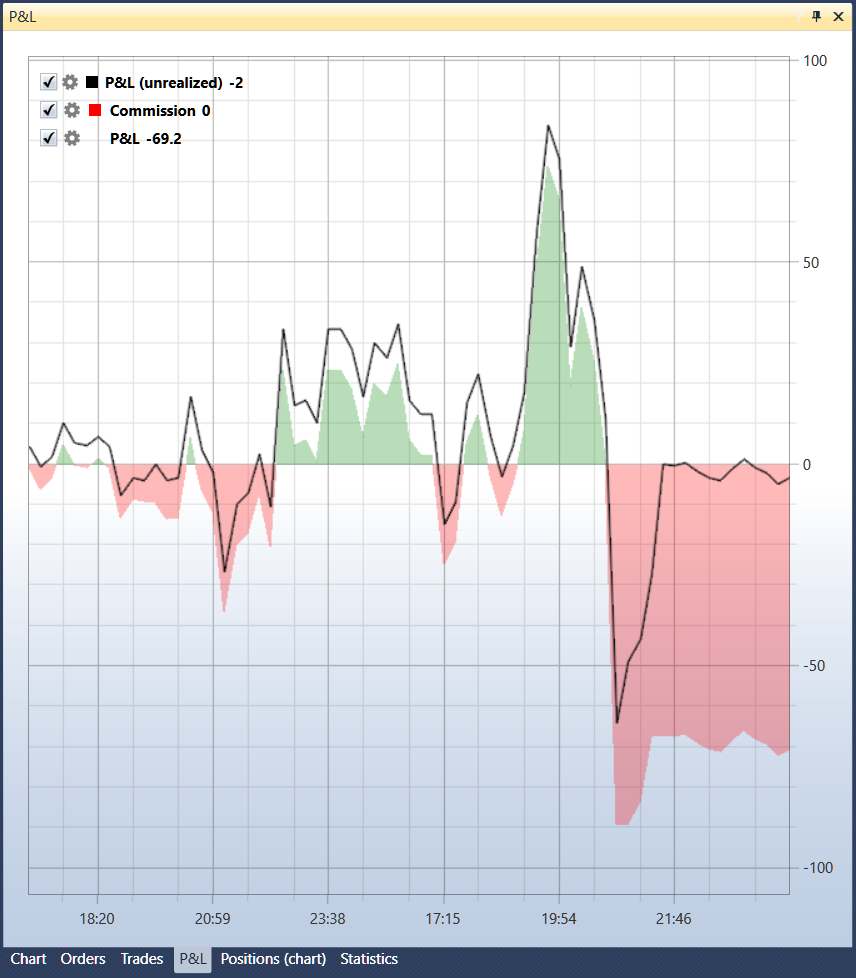

# Equity P&L

El componente P\/L es un gráfico de Profit\/Loss (no realizado), Profit\/Loss (realizado) y comisión. En la esquina superior izquierda del gráfico se muestran todos los elementos gráficos añadidos al gráfico; si quita la casilla  del elemento gráfico, el elemento también se elimina del gráfico. Al hacer clic en el botón , se abrirá la configuración del elemento gráfico.

## Contenido recomendado

[Ejemplo de ejecución en vivo](../../live_execution/live_execution_sample.md)
