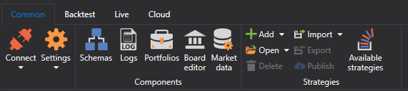

# Cinta

El elemento principal de la interfaz de usuario de [Designer](../../designer.md) es la **Cinta**, que se encuentra en la parte superior de la ventana de la aplicación. La cinta permite acceder rápidamente a los comandos necesarios. Los comandos se organizan en grupos lógicos reunidos en pestañas. Para ir a la pestaña deseada, basta con hacer clic en su título (nombre). Cada pestaña está asociada con el tipo de acción que se realiza.

1. La pestaña **Común**, que se abre de forma predeterminada después del inicio, contiene elementos que pueden ser necesarios en la etapa inicial de trabajo. Desde la pestaña **Común**, puede abrir [Configuración de conexión](../connections_settings.md), [Panel de esquemas](schemas.md), [Panel de registros](logs.md), [Carteras](portfolios.md), [Editor de mercados](boards.md), [Creación de un repositorio de datos históricos](../market_data_storage/getting_started.md). Además, en la pestaña **Común** puede añadir, abrir, eliminar, importar y exportar estrategias. Si desea compartir su estrategia con la comunidad, puede hacerlo haciendo clic en el botón *Publicar*. El botón adyacente, *Estrategias disponibles*, abre algoritmos publicados por usted y otros usuarios. A la derecha hay botones de servicio para llamar la ayuda y para contactarnos. Puede reportar un problema o escribirnos en el chat de Telegram.

2. La pestaña **Prueba histórica** se abre automáticamente al seleccionar una estrategia en el panel [Esquemas](schemas.md). La pestaña **Prueba histórica** contiene los elementos principales para crear, depurar, probar y optimizar estrategias ([Creación de una estrategia](../strategies/using_visual_designer.md), [Ejemplo de pruebas históricas](../backtesting/getting_started.md)). Además, en esta pestaña se inicia la estrategia para la negociación real y se seleccionan los componentes necesarios para su estrategia: gráfico, libro de órdenes, operaciones, etc.

3. La pestaña **En vivo** está destinada específicamente a la negociación real. Los detalles de configuración de conexión se describen en [Configuración de conexión](../connections_settings.md). La negociación real con [Designer](../../designer.md) se describe en [Negociación en vivo](../live_execution/getting_started.md).

4. La pestaña **Nube**. [Designer](../../designer.md) está diseñado para trabajar con servicios en la nube. Permite ver *tareas en la nube* completadas, obtener información sobre instrumentos disponibles en la nube y configurar trabajo remoto con canales y robots.

## Véase también

[Espacio de trabajo](workspace.md)
