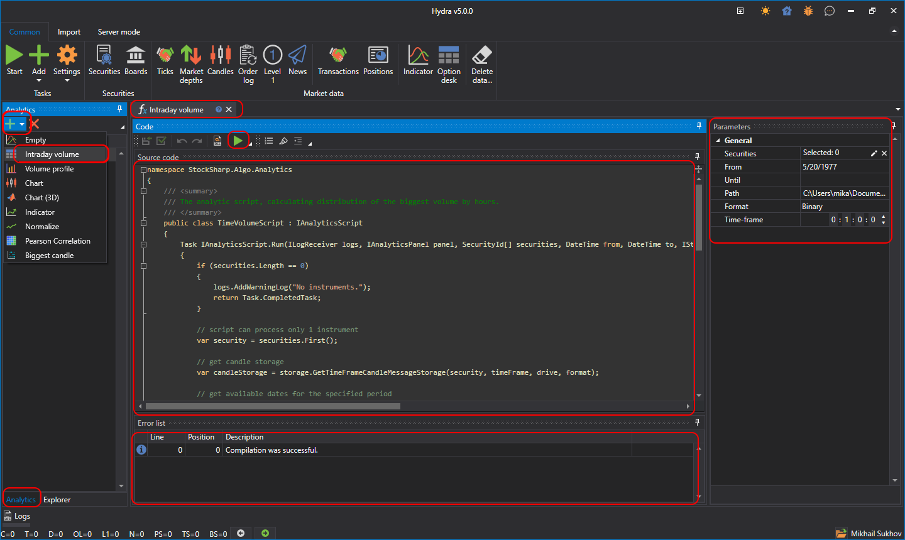

# Ejecución de un script

Para crear un nuevo script analítico, seleccione la pestaña **Analítica** en el panel de fuentes de datos de la ventana principal y elija la plantilla deseada en el menú desplegable para un inicio rápido:

La captura muestra la interfaz principal de esta función, compuesta por varios componentes clave:

- **Árbol de navegación**: proporciona acceso rápido a distintas funciones de analítica y a scripts analíticos creados, como análisis de volumen intradía, perfil de volumen, gráficos, indicadores y otras herramientas de análisis.
- **Ventana de código**: muestra el código fuente del script analítico seleccionado. Los usuarios pueden editar directamente el código para personalizar o crear cálculos y estrategias analíticas.
- **Panel de parámetros**: en el lado derecho hay un panel de parámetros donde puede establecer parámetros para scripts analíticos, incluyendo selección de instrumentos, período de análisis, ruta de datos y otros ajustes.
- **Lista de errores**: en la parte inferior de la interfaz hay una lista de errores detectados durante la compilación o ejecución del script analítico.

El script analítico se formatea como una clase heredada de [IAnalyticsScript](xref:StockSharp.Algo.Analytics.IAnalyticsScript).

Al configurar parámetros:

- **Instrumento** puede establecerse de uno a varios instrumentos, según la lógica del script.

- El rango de fechas.
- El almacenamiento desde el que obtener los datos.
- El marco temporal de trabajo del script, si utiliza uno.

Al hacer clic en el botón **Iniciar** , se abrirá una nueva pestaña que mostrará los resultados de la ejecución del script.
