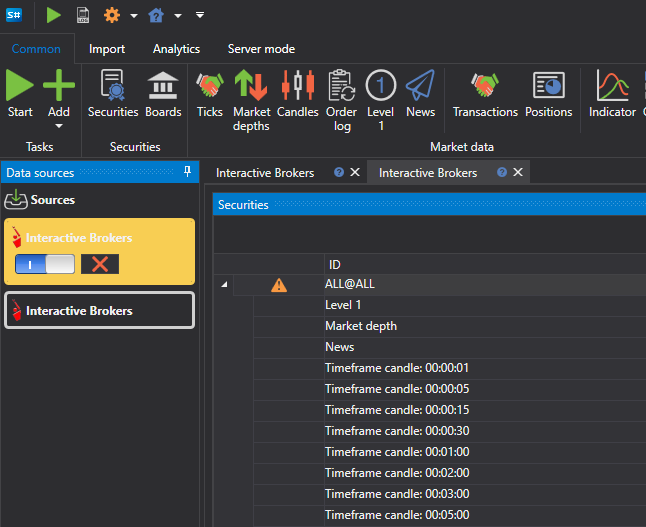

# Seleccionar fuente

Para añadir una nueva fuente de datos de mercado, debe:

- Ir a la pestaña **Común**
- Seleccionar **Añadir**
- Seleccionar **Fuentes**

Después aparecerá una lista de fuentes. El usuario puede seleccionar varias fuentes a la vez.

También puede crear varias instancias de la misma fuente. Por ejemplo, varias instancias de **Interactive Brokers** que guardarán los datos descargados en carpetas diferentes.

Para que la fuente empiece a descargar datos después de hacer clic en el botón **Iniciar**, debe estar habilitada. Para ello, seleccione el icono de la fuente en el panel izquierdo y utilice el botón  para activarla o desactivarla. Puede realizar esta operación antes o después de añadir instrumentos para la descarga.

Las fuentes innecesarias se pueden eliminar con el botón .

La configuración de la fuente se puede cambiar en el panel **Propiedades** del lado derecho.

La configuración común para todas las fuentes se encuentra en la sección [Configuración común de conexión](common_connection_settings.md).

Cada conexión tiene sus propias características. El enlace [Lista de conectores](../data_sources.md) contiene una lista de conectores y sus ajustes.

**Ver [tutorial en video](../videos/sources_samples.md)**
