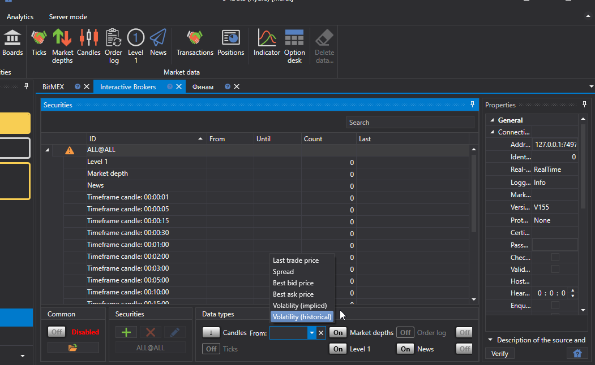

# Primer inicio

La primera vez que se ejecuta, aparece la siguiente ventana para seleccionar fuentes de datos. También puede abrir esta ventana en la pestaña **Common**, seleccionando **Add \=\> Sources**.

En la ventana, marque las fuentes necesarias. Puede usar filtros por región, mercado, tipo de datos, pago y disponibilidad en tiempo real. Cuando termine la selección, haga clic en **OK**. Después, el programa ofrecerá habilitar las utilidades. Para obtener más detalles sobre el trabajo con utilidades, consulte la sección [Utilidades](tasks.md). Haga clic en **OK**.

Después de esto, las fuentes se añadirán al panel izquierdo de la ventana principal de la aplicación.

## Descargar un instrumento para cargar datos de mercado:

Antes de empezar a descargar datos de mercado, debe configurar los instrumentos para los que necesita obtener datos.

Después de añadir fuentes de datos de mercado, en la parte central se abrirán los paneles de las fuentes añadidas, donde se muestra una lista de instrumentos. Si el panel está cerrado, para abrirlo haga doble clic en el logotipo de la fuente en la lista del lado izquierdo del programa.

Por ejemplo, descarguemos el instrumento AAPL@NASDAQ desde una fuente de datos compatible.

> [!TIP]
> ¡IMPORTANTE\! Los datos se descargan solo para los instrumentos añadidos a la lista de instrumentos.

1. Añadir instrumentos.

   En el primer inicio, el programa ofrecerá descargar todos los instrumentos de una vez para la fuente seleccionada. Más adelante, el usuario descargará los instrumentos por su cuenta. Inicialmente, la base de instrumentos de [Hydra](../hydra.md) está vacía; solo existe el instrumento auxiliar **ALL@ALL**. Al seleccionar este instrumento, se descargarán datos de todos los instrumentos disponibles para esta fuente.

   Para añadir un instrumento, haga clic en el botón **Add** . Después se abrirá una ventana para descargar el instrumento. 

   Para descargar los instrumentos, debe hacer clic en el botón correspondiente **Download securities**.

   Después aparecerá en pantalla un menú donde el usuario puede seleccionar **Download all securities**.

   O bien, para varias fuentes, [configurar](prepare_for_download/instruments_list.md) los instrumentos que necesita descargar.

   Cuando se reciban los instrumentos, la ventana tendrá este aspecto.

   En ella se enumerarán todos los instrumentos disponibles para añadir. Para una búsqueda rápida, puede introducir el nombre en el campo correspondiente.

   Para seleccionar un instrumento, haga doble clic en él y se moverá al lado derecho de la lista.

   Después se moverá al lado derecho de la tabla.

   Los instrumentos seleccionados se mostrarán en la tabla **Securities**, que tiene estructura de árbol. Su elemento principal es el instrumento; el elemento adicional son los tipos de datos de mercado que se recibirán para ese instrumento.
2. Para cada instrumento seleccionado, debe elegir los tipos de datos de mercado necesarios para la descarga.

   Si no se han establecido todos los parámetros necesarios del instrumento, aparecerá el icono  en la columna izquierda de la línea del instrumento. 

   Seleccionemos la descarga de **Ticks** y **Candles Time Frame 5**.

   En la parte inferior de la ventana de la fuente hay un panel con botones para configurar los datos y los instrumentos que se recibirán. 

   En este panel se pueden realizar las siguientes operaciones:
   - Configurar la cantidad de información recibida mediante los botones: **Trades, Order Books, Candles, Order Log, Level 1, Own Transactions**. Las listas de tipos de datos de mercado disponibles varían para distintas fuentes.
   - Especificar el Time Frame necesario para las velas cargadas. El Time Frame de las velas recibidas es distinto para diferentes fuentes.
   - Establecer el período necesario para descargar datos de mercado. El período también se puede configurar directamente en la ventana de datos de mercado. Para ello, debe seleccionar el inicio y el final del período.

     Si el usuario no especifica la fecha final del período, el programa descarga todos los datos disponibles hasta la fecha actual. Si la fuente admite transmisión de datos de mercado en tiempo real, cuando no haya fecha final del período los datos de mercado se descargarán en tiempo real.

     Establezcamos el período para el que se deben descargar los datos de mercado.
   - Especificar a partir de qué se construirán los datos de mercado. Si este parámetro no se especifica, se recibirán las velas disponibles en la fuente. Si el usuario especifica el tipo de datos de mercado, las velas se construirán a partir de ese tipo de datos. Por ejemplo, las velas pueden construirse a partir del precio de la última operación, del spread del libro de órdenes (normalmente para el mercado Forex), de la volatilidad o del mejor precio.

     Esta función es conveniente si la fuente no permite recibir datos para construir velas. En este caso, las velas se construyen con base en valores de datos promediados.

     El usuario también puede seleccionar un [tipo personalizado](prepare_for_download/custom_candles.md) de velas para configurar los datos recibidos.
   - Después de seleccionar un instrumento, un tipo de datos de mercado y establecer el período, debe hacer clic en el botón **Start**. Después comenzará la descarga de datos de mercado.

   El proceso de trabajo puede observarse en la pestaña especial **Logs**, fijada en la parte inferior del programa. Además, los registros se guardan en archivos en la carpeta local.

El usuario también puede añadir [fuentes adicionales](data_sources/select_source.md).

Después de descargar los datos de mercado, el usuario puede [ver datos de mercado](working_with_data/view_and_export.md), [construir velas](working_with_data/candles_generation.md), guardar o [exportar en distintos formatos](working_with_data/export_data.md).

**Ver [tutorial en video](videos/first_start.md)**.
