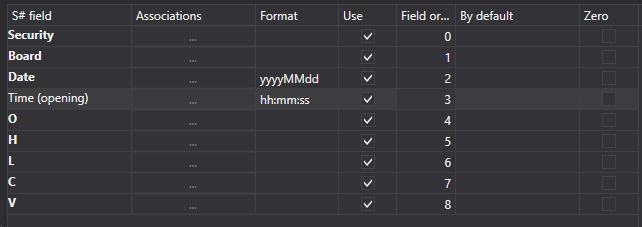

# Velas

Para importar velas, seleccione **Importar \=\> Velas** en el menú principal de la aplicación.


## Proceso de importación de velas

1. **Común**
   - **Tipo de datos** - tipo de datos importados.
   - **Nombre de archivo** - ruta completa al archivo CSV.
   - **Directorio de datos** - carpeta donde se guardarán los archivos finales de [S#](../../api.md).
   - **Máscara de archivo** - máscara de archivo que se usa al escanear el directorio. Por ejemplo, candle \_\*.csv.
   - **Separador de columnas** - separador de columnas. La tabulación se indica como TAB.
   - **Sangría desde el inicio** - número de líneas desde el inicio del archivo que se omitirán (si contienen metainformación).
   - **Zona horaria** - zona horaria.
   - **Intervalo** - frecuencia de actualización de datos.

   **Instrumentos**
   - **Información extendida** - guardar los campos importados extendidos en el almacenamiento de información extendida.
   - **Duplicados** - indica si los instrumentos duplicados se actualizarán si ya existen.
2. Configure los parámetros de importación para los campos de [S#](../../api.md).
   - **campo S#** - valor del campo S# (**Instrumento**, **Mercado**, etc.).
   - **Asociaciones** - asociar el valor de columna del archivo con el tipo de StockSharp (si es necesario).
   - **Formato** - formato de datos. Normalmente se usa al importar valores de fecha y hora (consulte [Operaciones](ticks.md)).
   - **Usar** - indica si se deben usar los datos durante la importación.
   - **Orden de campos** - secuencia en la que se organizan las columnas de propiedades del elemento importado.

     Por ejemplo, si el archivo importado tiene el siguiente tipo de plantilla:

     ```none
     {SecurityId.SecurityCode},{SecurityId.BoardCode},{OpenTime:yyyyMMdd},{OpenTime:default:HH:mm:ss},{OpenPrice},{HighPrice},{LowPrice},{ClosePrice},{TotalVolume}

     ```

     Entonces le corresponderá la siguiente configuración:

     Aquí:

     El valor **Instrumento** corresponde a **{SecurityId.SecurityCode}** con el número de orden **0**.

     > [!TIP]
     > En programación, el número ordinal del primer elemento siempre es 0.

     El valor **Mercado** corresponde a **{SecurityId.BoardCode}** con el número de orden **1**. Y así sucesivamente.
   - **Predeterminado** - valor predeterminado del campo. Por ejemplo, puede usarse para valores repetidos de campos (**Instrumento** o **Mercado** al importar operaciones, libros de órdenes, etc.; consulte [Operaciones](ticks.md)), si la información correspondiente no está en el archivo de datos.
   - **Cero** - en algunos casos, al guardar datos, ciertas propiedades pueden guardarse como "0", lo que es un error. Por ejemplo, por distintas razones el precio puede ser igual a 0; esto no es aceptable y en el futuro provocará una lectura incorrecta. Esto puede causar un funcionamiento incorrecto de las estrategias que trabajan con esos datos y, como consecuencia, un resultado erróneo. Al marcar esta casilla, el usuario especifica que los datos de esta sección, si son iguales a 0, se escriban como vacíos, es decir, como ausentes. En el trabajo posterior, por ejemplo durante las pruebas, el usuario verá un error de ausencia de datos, lo que indicará una importación incorrecta. En realidad, esto protege al usuario frente a datos "rotos" y permite trabajar de forma más correcta.

   El usuario puede configurar una gran cantidad de propiedades para los datos descargados. Basándose en la plantilla del archivo importado, debe especificar la propiedad y asignarle el número requerido en la secuencia.
3. Para previsualizar los datos, haga clic en el botón **Vista previa**.
4. Haga clic en el botón **Importar**.
