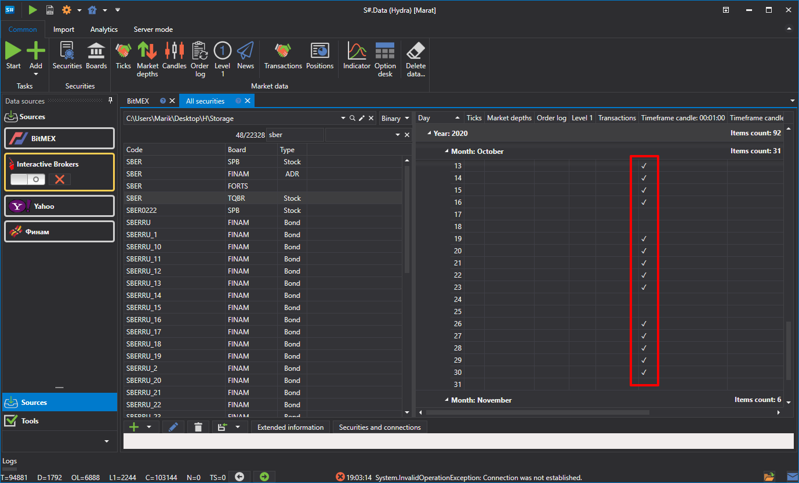
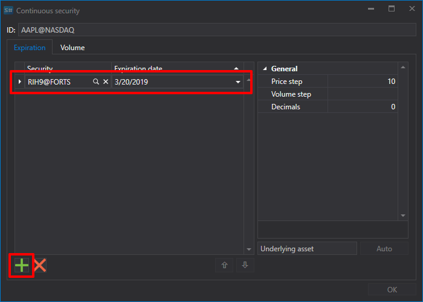

# Futuros continuos

El programa [Hydra](../../hydra.md) permite al usuario combinar distintos tipos de datos de mercado de varios contratos en un único instrumento continuo.

Para ello, en la pestaña **Common** seleccione **Securities** para que aparezca la pestaña **All securities**. Antes de combinar los datos, compruebe qué datos de mercado están disponibles. Seleccione la ruta donde se encuentran los datos y revise los instrumentos que planea combinar. Si hay huecos, descargue los datos de mercado faltantes (por ejemplo, desde una fuente de datos compatible).

Como ejemplo, consideremos la combinación de futuros E-mini S&P 500.

1. Para crear un contrato de futuros continuo, haga clic en el botón **Create security \=\> Continuous security** en la pestaña **All securities**.

   Después aparecerá la siguiente ventana:
2. Para crear un futuro continuo, debe especificar un nombre y añadir contratos.

   Hay dos formas de añadir contratos.
   - Manualmente, haciendo clic en el botón .
   - Si establece como nombre las dos primeras letras del contrato, por ejemplo RI, y hace clic en el botón **Auto**, se añadirán todos los instrumentos encontrados en la base de datos.
3. Seleccione los contratos necesarios y establezca sus fechas de transición. 
4. Después, asigne el identificador de instrumento **ES\_continuous@CME** y haga clic en el botón **OK**; se creará un nuevo instrumento.
5. Luego haga clic en el botón [Candles](../working_with_data/view_and_export/candles.md) en la pestaña **Common**, seleccione el instrumento resultante y el período de datos, establezca el valor **Composite element** en el campo **Build from** y haga clic en el botón . 

Los datos generados se pueden exportar a formatos Excel, XML, JSON o TXT. La exportación se realiza mediante la lista desplegable.

