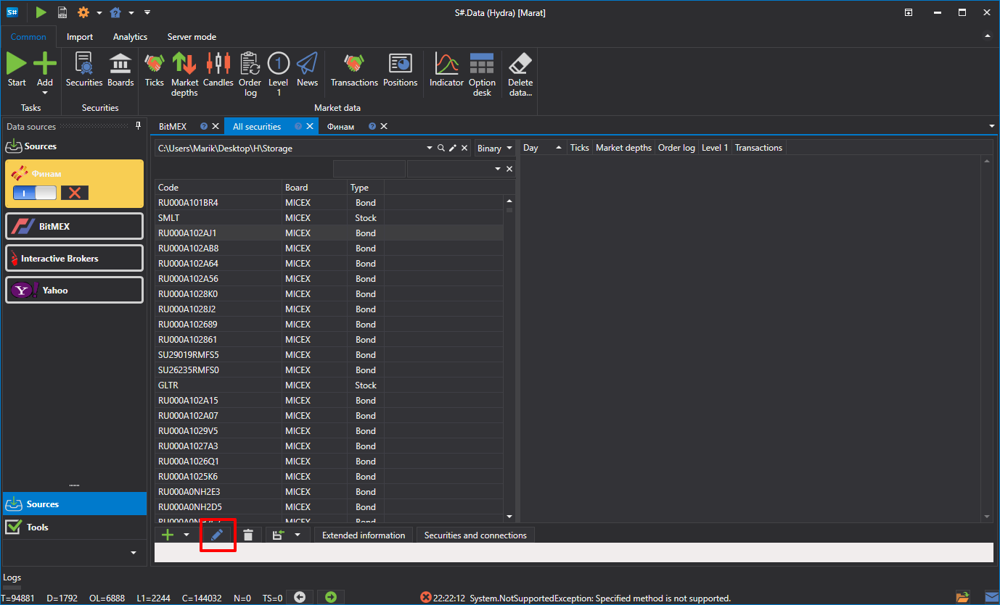
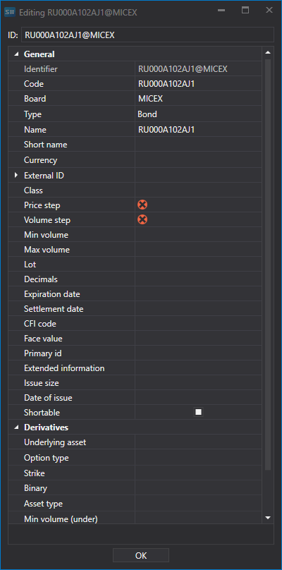

# Edición de instrumentos

Para editar un instrumento (por ejemplo, si se creó sin todos los datos necesarios), haga doble clic en el instrumento o haga clic en el botón  para abrir la ventana donde puede realizar los cambios necesarios:

Vaya a la ventana **Securities**.

Se abrirá la ventana de edición.

Si es necesario, puede editar el grupo de instrumentos. Seleccione un grupo de instrumentos y haga clic en el botón .

Después edite el grupo según sea necesario.

Si todos los instrumentos seleccionados tienen el mismo valor en un campo, se mostrará ese valor. Si los valores difieren, el campo estará vacío. Por ejemplo, si dos instrumentos tienen un Price Step de 1, pero uno tiene un tamaño de lote de 10 y el otro de 100, el campo Price Step mostrará 1 y el campo Volume Step estará vacío.
