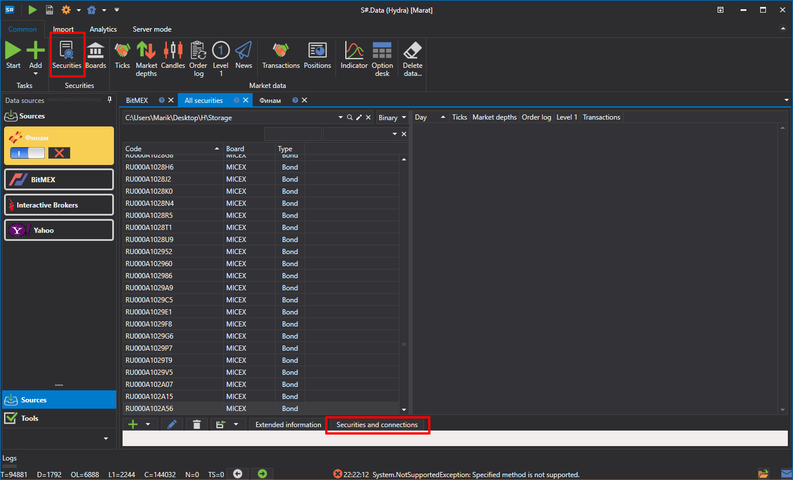

# Asociación de instrumentos y conexiones

El mismo instrumento puede llamarse de forma diferente en distintos sistemas de negociación. Es posible asociar el instrumento con las conexiones a través de las cuales se negociará y especificar cómo se identifica en el sistema de negociación externo.

Esto permite organizar los datos recibidos y simplificar el almacenamiento. En la práctica, todos los datos entrantes de distintas fuentes se consolidarán en un solo lugar, no por el nombre de la fuente, sino por el nombre del instrumento.

Esto también es útil al negociar el mismo instrumento en distintos mercados o a través de distintas conexiones (o brókeres). Además, permite obtener datos desde una conexión y realizar operaciones a través de otra.

Para asociar instrumentos y conexiones, siga estos pasos:

1. Vaya a la pestaña **Instrumentos** y haga clic en el botón **Instrumentos y conexiones**.
2. En la lista de conexiones, seleccione la conexión necesaria.
3. Rellene todas las columnas.

   Por ejemplo:

   Instrumento de acciones APPLE.
   - Conexión - **Interactive Brokers**. Haga clic en el botón , después de lo cual se añadirá una nueva línea.
   - En las columnas **Código de instrumento** y **Código de mercado**, especifique el código del instrumento y el código del mercado. En las columnas **Código de instrumento en el adaptador** y **Código de mercado en el adaptador**, especifique el código del instrumento y el código del mercado tal como están especificados en el sistema de negociación externo. Haga clic en **Aceptar** 
   - Repita los pasos para las conexiones **Interactive Brokers** y **CQG Continuum** de la misma forma.

   | **Interactive Brokers**                                                           | **CQG Continuum**                                                                 |
   | --------------------------------------------------------------------------------- | --------------------------------------------------------------------------------- |
   |  |  |
4. Ahora todos los datos descargados, en nuestro caso para las acciones APPLE, se guardarán en un solo lugar.
