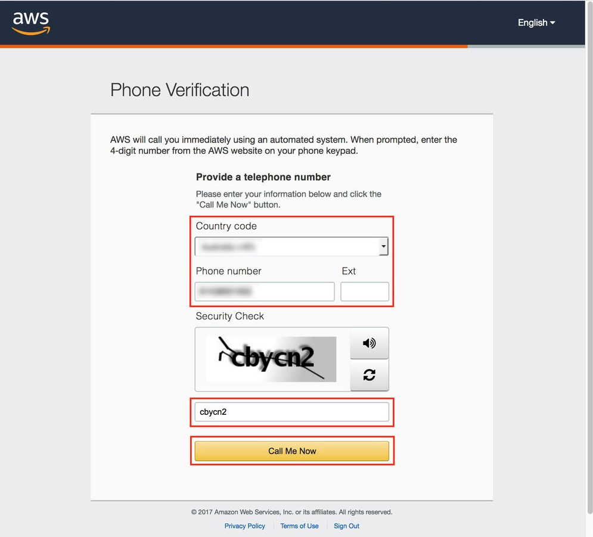
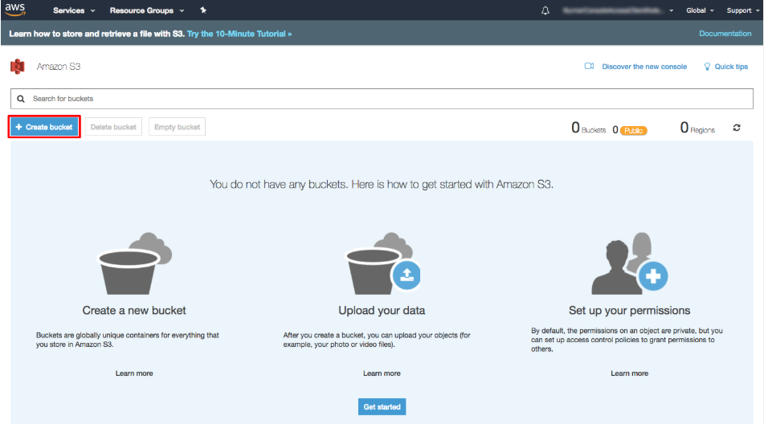
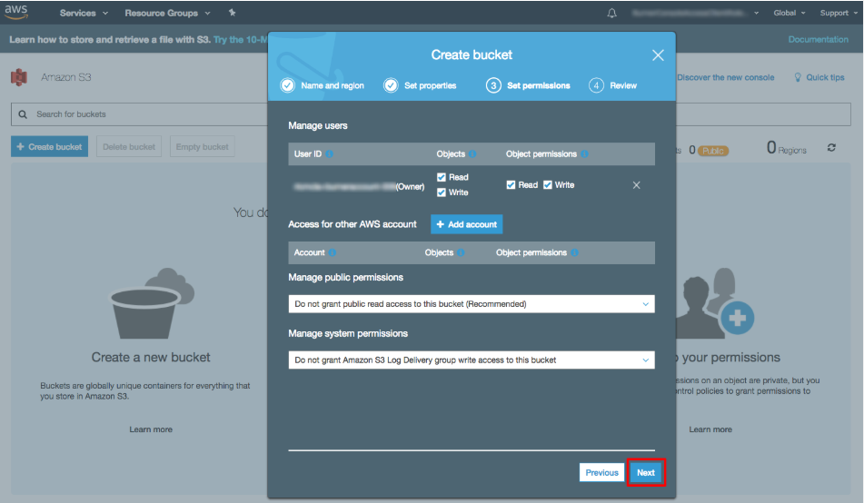
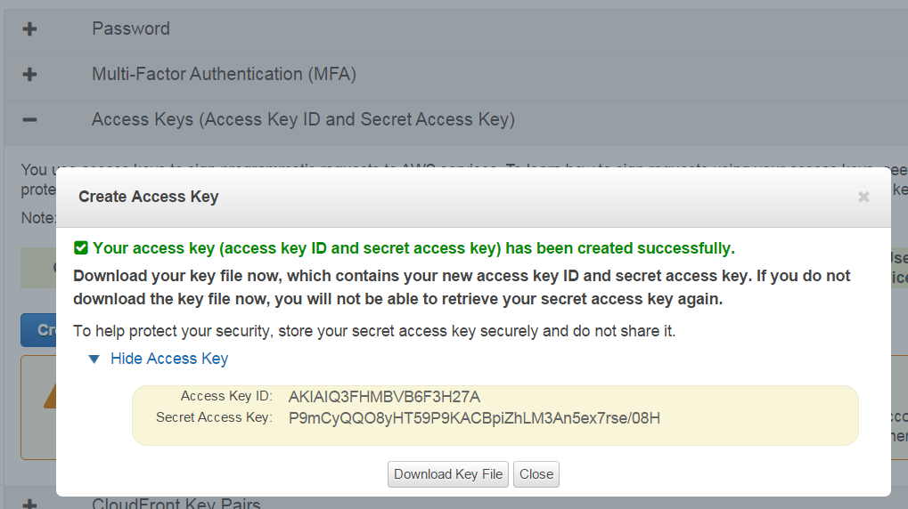

# Configuración

A continuación se describe cómo crear y configurar una cuenta de AWS.

1. Para crear una cuenta de AWS, vaya a la página [Crear una cuenta de AWS](https://aws.amazon.com/ru/) y haga clic en el botón **Crear cuenta**.
2. Después, rellene los formularios que ofrecerá el servicio web.
3. Introduzca los datos de su tarjeta; esto se hace para verificar su identidad.
4. En uno de los pasos de registro, se le pedirá que introduzca un número de teléfono e inicie una llamada a su teléfono con el botón **Call Me Now**.

   Debe responder la llamada y marcar en el teléfono el código que se mostrará en la pantalla del ordenador.
5. Después se le pedirá seleccionar un plan de soporte. Al finalizar la creación de la cuenta, debe ir a la consola de administración.
6. El primer paso para configurar una cuenta es crear un Bucket.

   Bucket es un contenedor para almacenar objetos en la nube. Para el Bucket debe establecer un nombre único y seleccionar un centro de datos regional (Region) donde se almacenarán físicamente los datos. Tenga en cuenta que más adelante, al configurar la tarea de copia de seguridad: 1) en el campo **Almacenamiento** deberá introducir el nombre del bucket, 2) en el campo **Dirección** debe usar no el nombre, sino la dirección del centro de datos regional, que puede encontrarse [aquí](https://docs.aws.amazon.com/general/latest/gr/rande.html#s3_region). Después continúe la configuración.
7. Después debe configurar claves para acceder programáticamente a los servicios de AWS. Para ello, vaya al enlace **Security Credentials** en la consola de AWS.
8. Despliegue el encabezado **Access Keys (Access Key ID and Secret Access Key)** y cree claves de acceso con el botón .

  Las claves creadas se pueden guardar en un archivo con el botón **Download Key File**.

   Tenga en cuenta que al configurar una tarea de copia de seguridad, **Access Key ID** debe usarse como inicio de sesión y **Secret Access Key** como contraseña.

## Contenido recomendado

[Creación y configuración de una tarea](hydra_settings.md)
