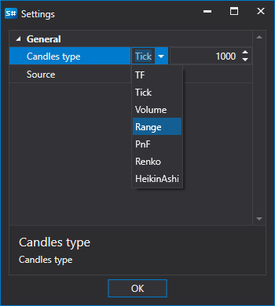

# Velas personalizadas

El usuario puede seleccionar un **tipo personalizado** de velas y elegir de forma independiente qué velas se construirán; las velas se construirán "sobre la marcha", es decir, inmediatamente.

Consideremos un ejemplo de esta construcción. La bolsa **Bitmex** no proporciona la posibilidad de recibir velas con un marco temporal de 10 minutos.

Secuencia para obtener dichas velas:

1. Seleccione velas **personalizadas**.
2. En la configuración, especifique velas **TF** y un período de 10 minutos.
3. En la fuente, especifique a partir de qué se construirán las velas: **Registro de órdenes** 
4. Establezca el período. Como puede ver, junto al nombre de la vela apareció la indicación **Generadas**.
5. Haga clic en Iniciar y los datos empezarán a descargarse.
6. Vaya a la sección de velas y [vea los datos descargados](../working_with_data/view_and_export.md).

Como puede ver, los datos se han recibido correctamente.

Consideremos un ejemplo en el que necesitamos obtener un [RangeCandleMessage](xref:StockSharp.Messages.RangeCandleMessage):

1. Seleccione velas **personalizadas**.
2. En la configuración, especifique velas Range y el volumen 10.
3. En la fuente, especifique a partir de qué se construirán las velas: **Ticks**.
4. Establezca el período.
5. Haga clic en Iniciar y los datos empezarán a descargarse.
6. Vaya a la sección de velas y [vea los datos descargados](../working_with_data/view_and_export.md).
