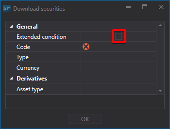

# Lista de instrumentos

Configuración del instrumento para la descarga.

Para varias fuentes, es posible configurar la descarga de los instrumentos necesarios.

Tomemos como ejemplo la descarga de instrumentos desde la fuente **Interactive Brokers**:

1. Seleccione la descarga de instrumentos y haga clic en el botón **Condición extendida**.
2. Después se abrirá una lista de configuración avanzada para el instrumento descargado.
3. Debe descargar un instrumento que cumpla los siguientes parámetros: acción de APPLE, divisa: dólar estadounidense. Para ello, establezca los parámetros del instrumento como se muestra a continuación y haga clic en **OK**.

   Después de esto, el programa [Hydra](../../hydra.md) descargará todos los instrumentos que cumplan los parámetros especificados. 

La configuración permite al usuario seleccionar varios parámetros para el instrumento descargado.

Así, por ejemplo, el usuario puede seleccionar:

- **Paso de precio y volumen**
- **Volúmenes mínimo y máximo**
- **ID externo** 
- Para opciones, permite establecer el **Activo subyacente** y el **Tipo de activo** (tipo del instrumento subyacente). 

**Ver [tutorial en video](../videos/instruments_downloading.md)**
