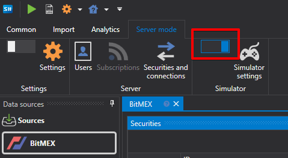

# Configuración de emulación

En modo servidor, el programa permite habilitar el modo de emulación.

En modo de emulación, el programa [Hydra](../../hydra.md) permite realizar las siguientes funciones:

- El programa permite configurar las claves para conectarse a la fuente y trabajar simultáneamente con una conexión en distintos programas ([Designer](../../designer.md), [Terminal](../../terminal.md)).
- Si la fuente de datos de mercado permite descargar datos históricos, estos pueden usarse simultáneamente para pruebas.
- Si la fuente permite recibir datos en tiempo real, el modo de emulación permite emular el modo de negociación. En este modo, los datos sobre las acciones del usuario (registro de órdenes, operaciones) se transfieren directamente a Hydra, mientras que las acciones se registran por separado para cada programa. Por ejemplo, al registrar una orden en Terminal, sus cambios serán visibles solo allí, y en Designer no se registrarán. Esto evita conflictos entre dos programas que funcionan sobre la misma conexión.
- ¡IMPORTANTE\! Las operaciones realizadas en modo de emulación, la negociación y las operaciones sobre ellas se emulan en tiempo real; cuando el modo está desactivado, las acciones se realizarán en negociación real.

Este modo se utiliza al [probar estrategias](../../shell/user_interface/emulation.md).

## Configuración de emulación.

- **Coincidir al tocar** - al emular la coincidencia de operaciones, hacer coincidir órdenes cuando el precio de la operación sea igual al precio de la orden.
- **Libro de órdenes (vigencia)** - período máximo de vigencia del libro de órdenes en el emulador. Si el libro de órdenes no se ha actualizado durante el período especificado, su valor se borra. Se usa para eliminar datos antiguos del libro de órdenes si hay huecos en los datos.
- **Porcentaje de errores** - porcentaje de errores al registrar nuevas órdenes (de 0 a 100).
- **Latencia** - latencia mínima de las órdenes registradas.
- **Reinscripción** - indica si se admitirá la reinscripción de órdenes como una única transacción.
- **Período de búfer** - parámetro responsable del período de envío de paquetes completos para emular la latencia de red y almacenar en búfer el trabajo del núcleo de la bolsa.
- **ID de orden** - número con el que el emulador generará identificadores de órdenes.
- **Identificador de operación** - número con el que el emulador generará identificadores de operaciones.
- **Transacción** - número con el que el emulador generará identificadores de transacciones de órdenes.
- **Tamaño del spread** - tamaño del spread en pasos de precio. Se usa para determinar el spread al generar el libro de órdenes a partir de operaciones tick.
- **Profundidad del libro de órdenes** - profundidad máxima del libro de órdenes generado por ticks.
- **Número de pasos de volumen** - número de pasos de volumen por los que la orden es mayor que la operación tick. Se usa en pruebas sobre operaciones tick.
- **Intervalo de cartera** - intervalo para recalcular datos de carteras. Si el intervalo es 0, no se realiza recálculo.
- **Ajustar hora** - ajustar la hora de órdenes y operaciones a la hora de la bolsa.
- **Zona horaria** - información sobre la zona horaria donde se encuentra la bolsa.
- **Desplazamiento de precio** - desplazamiento de precio respecto a la última operación, que determina los límites de precios máximo y mínimo para la siguiente sesión.
- **Añadir volumen adicional** - añadir volumen adicional al libro de órdenes al registrar órdenes con gran volumen.
- **Estado de la sesión de negociación** - comprobación del estado de negociación.
- **Dinero** - comprobar el saldo monetario.
- **Corto** - posibilidad de abrir posiciones cortas.
- **Almacenamiento** - almacenamiento.
