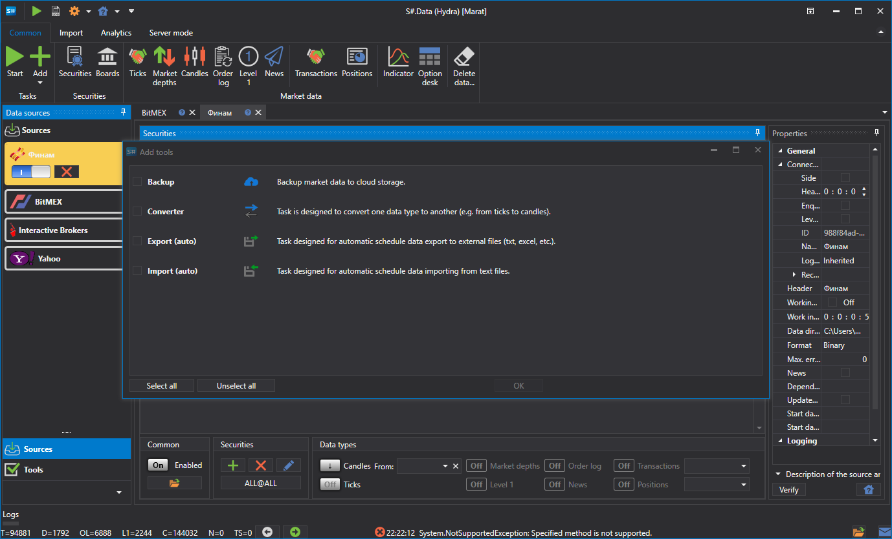

# Tareas

La herramienta es una acción repetida en un momento específico.

Para ver la lista de herramientas, seleccione el elemento **Herramientas** en el panel izquierdo. El trabajo con herramientas es igual que con las fuentes: la herramienta se puede añadir, eliminar, editar y habilitar\/deshabilitar. Para añadir una **Herramienta**, en la pestaña **Común**, seleccione **Añadir \=\> Herramientas**. Aparecerá una ventana correspondiente donde podrá seleccionar la **Herramienta** necesaria...

Actualmente, hay cuatro clases de tareas en [Hydra](../hydra.md):

- [Importación automática](tasks/import_auto.md) - la tarea consiste en importar datos desde formato CSV.
- [Convertidor](tasks/converter.md) - la tarea consiste en convertir datos bursátiles a ticks, velas o libros de órdenes.
- [Exportación automática](tasks/export_auto.md) - la tarea consiste en exportar velas a distintos formatos.
- [Copia de seguridad](misc/backup.md) - la tarea consiste en crear una copia de seguridad de datos en el servicio en la nube.
