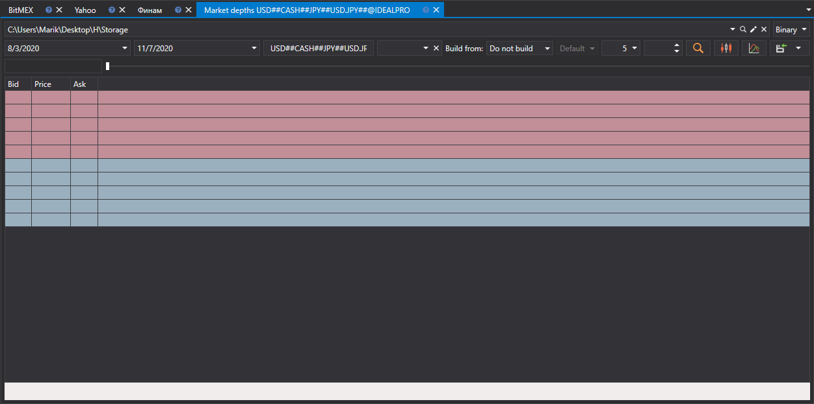

# Cualquier tipo de dato de mercado

[Hydra](../../hydra.md) permite usar tipos de datos alternativos para obtener distintos tipos de datos de mercado.

Esto es necesario si la fuente no permite descargar los datos de mercado requeridos. Así, por ejemplo, se pueden usar varios tipos de datos de mercado a la vez para construir el **libro de órdenes**.

¡IMPORTANTE\! **Libro de órdenes** puede construirse a partir de **Registro de órdenes** o **Level 1**, siempre que estos tipos de datos contengan los mejores precios.

Recuerde que los valores de **Level 1** se pueden descargar desde cualquier fuente que proporcione datos de mercado en tiempo real. **Level 1** también se puede recibir mediante [conversión](../tasks/converter.md) desde **libro de órdenes**.

Para construirlo, debe:

1. Seleccionar el período y el instrumento para los que desea obtener datos de mercado.
2. Seleccionar el campo **Construir a partir de** y elegir el tipo de datos requerido.

   ¡IMPORTANTE\! Si se seleccionan **Libro de órdenes, Registro de órdenes, Level 1** como fuente para construir una vela, aparece una selección de parámetros adicionales.
3. Después de establecer los parámetros, haga clic en el botón .

Para construir **Velas**, también está disponible la opción de construir velas de un marco temporal mayor a partir de velas de un marco temporal menor.

Por ejemplo, si hay velas con un marco temporal de 1 minuto, puede construir velas con un marco temporal de 5 minutos a partir de ellas seleccionando el tipo correspondiente en la línea **Construir a partir de**.

**Ver [tutorial en video](../videos/building_order_books.md)**
