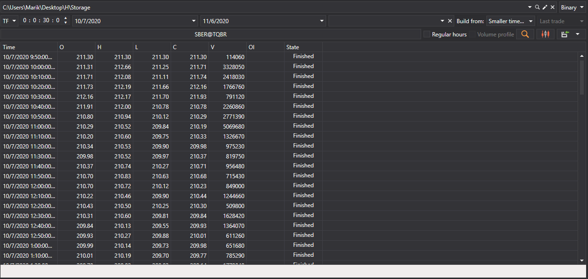
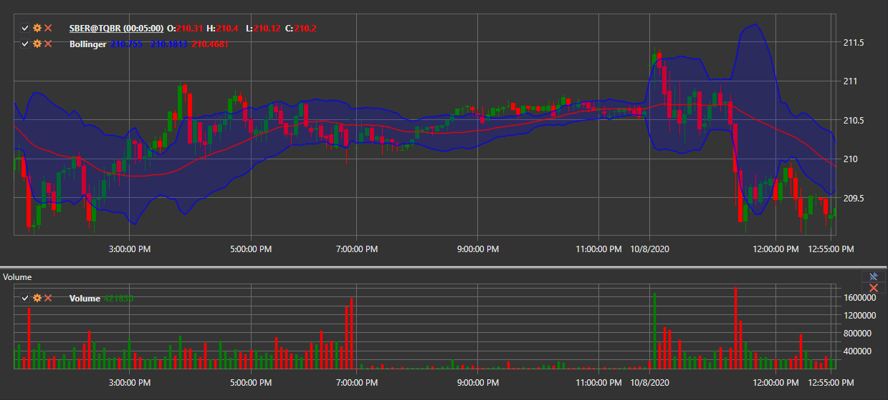

# Generación de velas

[Hydra](../../hydra.md) permite generar distintos tipos de velas basadas en operaciones descargadas, que posteriormente se pueden exportar a formatos [Excel](https://en.wikipedia.org/wiki/Excel), XML, SQL, BIN, JSON o TXT.

Esto permite usar los datos generados en cualquier programa de análisis técnico (WealthLab, AmiBroker, etc.).

## Proceso de generación de velas

1. En la pestaña **General**, haga clic en el botón **Velas**; se abrirá la siguiente ventana:

   

2. En la ventana abierta, debe configurar los parámetros de generación de velas:

   - Seleccione el tipo de vela deseado en la lista desplegable (se admiten todos los [tipos estándar de velas](../../api/candles.md)).
   - Especifique los parámetros necesarios para el tipo de vela seleccionado:
     - Para [TimeFrameCandleMessage](xref:StockSharp.Messages.TimeFrameCandleMessage) - seleccione **Marco temporal**
     - Para [VolumeCandleMessage](xref:StockSharp.Messages.VolumeCandleMessage) - especifique **Volumen**
     - Para [TickCandleMessage](xref:StockSharp.Messages.TickCandleMessage) - especifique **Número de ticks**
     - Para [RangeCandleMessage](xref:StockSharp.Messages.RangeCandleMessage) - especifique **Rango**
     - Para [RenkoCandleMessage](xref:StockSharp.Messages.RenkoCandleMessage) - especifique **Tamaño de bloque**
     - Para [PnFCandleMessage](xref:StockSharp.Messages.PnFCandleMessage) - especifique **Parámetros P&F**
   - Seleccione el instrumento para el que se generarán las velas.
   - Especifique un rango de tiempo (si es necesario).
   - Haga clic en el botón  para iniciar la generación.

### Ejemplo de generación de velas por marco temporal

Para generar velas de 5 minutos para el instrumento AAPL@NASDAQ:

1. Seleccione el tipo de vela [TimeFrameCandleMessage](xref:StockSharp.Messages.TimeFrameCandleMessage).
2. Establezca **Marco temporal** = 5 min.
3. Seleccione el instrumento AAPL@NASDAQ.
4. Haga clic en el botón de búsqueda.

Después de la generación de datos, verá el resultado:

### Ejemplo de generación de velas por volumen

Para generar velas por volumen:

1. Seleccione el tipo de vela [VolumeCandleMessage](xref:StockSharp.Messages.VolumeCandleMessage).
2. Especifique el volumen (por ejemplo, 100).
3. Seleccione el instrumento.
4. En el campo **Construir a partir de**, seleccione **Ticks**.
5. Haga clic en el botón de búsqueda.

Resultado de la generación:

## Fuentes de datos para construir velas

Si no fue posible obtener datos de mercado directamente desde la fuente, puede generar velas seleccionando en el campo [**Construir a partir de**](any_market_data_types.md) el tipo de datos a partir del cual se construirán:

- **Ticks** - construcción de velas a partir de datos tick.
- **Libros de órdenes** - construcción de velas a partir de datos del libro de órdenes.
- **Level1** - construcción de velas a partir de datos Level1.
- **Marco temporal menor** - construcción de velas con un marco temporal mayor a partir de velas con uno menor.

### Ejemplos de distintas opciones de construcción:

- Velas de 10 minutos a partir de ticks:

  

- Velas de 30 minutos a partir de velas de 5 minutos:

  

> [!TIP]
> Si selecciona **no construir** en el campo **Construir a partir de**, solo se buscarán velas preparadas que se descargaron directamente mediante la fuente de datos.

## Visualización de velas generadas

Para mostrar gráficamente las velas generadas:

1. Haga clic en el botón .
2. Se abrirá un gráfico con las velas construidas:

   

   

## Añadir indicadores al gráfico

Se pueden añadir indicadores técnicos al gráfico de velas:

1. Abra el menú contextual haciendo clic derecho en el panel del gráfico.
2. Seleccione el elemento **Indicator** y el indicador deseado de la lista.
3. Para mostrar el indicador en un panel separado:
   - Añada un nuevo panel usando el botón .
   - Seleccione el indicador deseado en el menú contextual.

Ejemplo de gráfico con indicadores añadidos:

## Exportación de datos

Los valores de velas obtenidos se pueden [exportar a distintos formatos](export_data.md) para usarlos en otros programas.

**Consulte también el [tutorial en video](../videos/building_candles.md) sobre la construcción de distintos tipos de velas**
