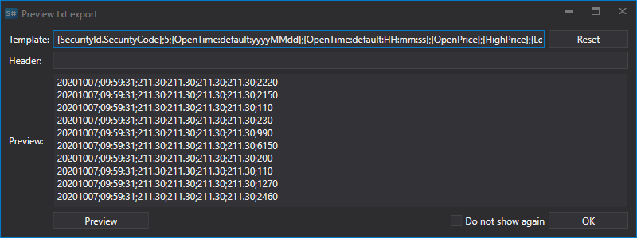

# Exportación a MetaStock

Para exportar datos a archivos de formato MetaStock, seleccione el formato Txt en la lista desplegable:


Al exportar a archivos de formato de texto (Txt), aparece una ventana:



En esta ventana, especifique la plantilla de exportación, donde las llaves indican las propiedades que se exportarán y su orden:

```none
{SecurityId.SecurityCode},5,{OpenTime:yyyyMMdd},{OpenTime:HHmmss},{OpenPrice},{HighPrice},{LowPrice},{ClosePrice},{TotalVolume}
	  				
```

En el ejemplo, el marco temporal de la vela de cinco minutos se especifica en la segunda posición.

Además, la primera línea (Header) debe establecerse en el archivo:

```none
<TICKER>,<PER>,<DATE>,<TIME>,<OPEN>,<HIGH>,<LOW>,<CLOSE>,<VOL>
	  				
```
