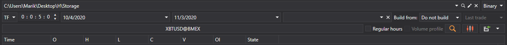
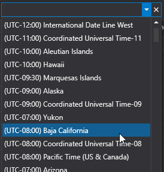
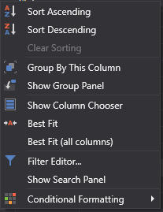

# Ver y exportar

Los datos recibidos por [Hydra](../../hydra.md) se pueden ver en paneles especiales.

Para ello, en la pestaña **Común**, haga clic en uno de los siguientes botones: [Ticks](view_and_export/ticks.md), [Libros de órdenes](view_and_export/order_books.md), [Generación de velas](candles_generation.md), [Registro de órdenes](view_and_export/order_log.md), [Level 1](view_and_export/level_1_.md), [Noticias](view_and_export/news.md), [Transacciones](view_and_export/transactions.md), [Panel de opciones](view_and_export/option_desk.md), [Indicadores](view_and_export/indicators.md), [Posiciones](view_and_export/positions.md).

O haga clic derecho en el tipo de datos requerido, como se muestra en la figura, así como doble clic en el tipo de datos requerido.

Cada panel contiene una interfaz general de configuración como la siguiente:

- La línea superior indica el almacenamiento de datos de mercado y su formato (BIN o CSV).
- La línea inferior establece el período para el que se solicitarán los datos. Al hacer clic en el botón **Seleccionar instrumento**, aparecerá la ventana de selección de instrumentos, donde puede seleccionar uno o varios instrumentos. Si se seleccionan varios instrumentos, durante la exportación posterior a Excel o CSV el programa ordenará automáticamente los datos de distintos instrumentos en archivos diferentes.
- Si, al construir una tabla con datos, la cantidad de datos descargados supera el límite establecido, aparecerá una ventana en pantalla:

  debe aumentar el límite de datos descargados.
- Si los datos se recibieron de fuentes cuya zona horaria no coincide con la zona horaria actual, puede ajustar la zona horaria. Después de construir, los datos se mostrarán en la zona seleccionada por el usuario. 
- Como varias fuentes no ofrecen la posibilidad de descargar algunos datos, el programa proporciona el campo [Construir a partir de](any_market_data_types.md). Con este campo, el usuario puede construir datos de mercado a partir de otro tipo de datos de mercado. La misma función puede usarse para construir datos de mercado sin descarga adicional, usando como base datos ya existentes.
- Después de seleccionar los parámetros anteriores, debe hacer clic en el botón .

Con el menú contextual, puede configurar distintos parámetros de la tabla de valores de datos de mercado: agrupación de filas, columnas disponibles, formato de visualización, etc.

