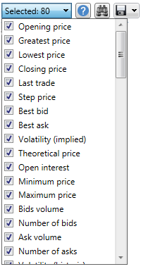

# Level 1

En la ventana que aparece, seleccione los instrumentos, el intervalo de tiempo requerido y haga clic en el botón :

También puede elegir qué tipos de cambios deben exportarse. Esto se hace mediante la lista desplegable mostrada a continuación:

Los valores recibidos se pueden [exportar al formato requerido](../export_data.md).
