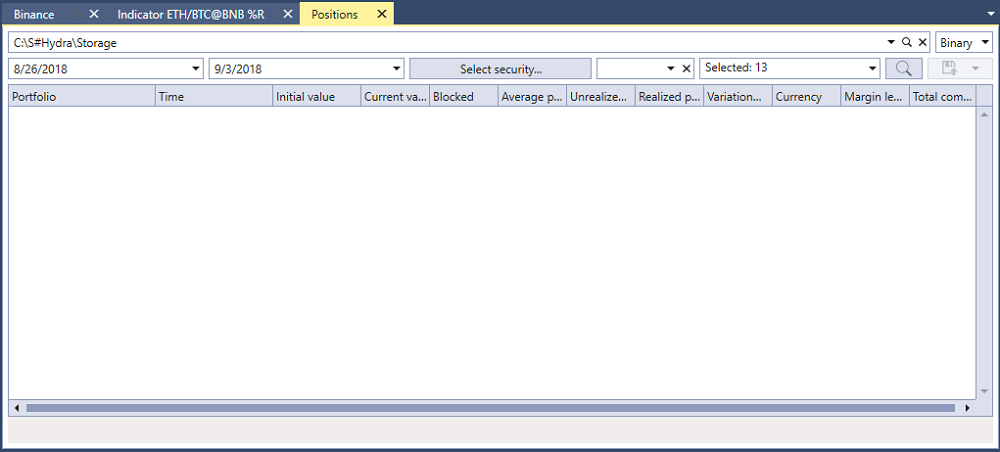

# Posiciones

En la ventana que aparece, seleccione los instrumentos, el intervalo de tiempo requerido y haga clic en el botón :

Los valores recibidos se pueden [exportar al formato requerido](../export_data.md).
