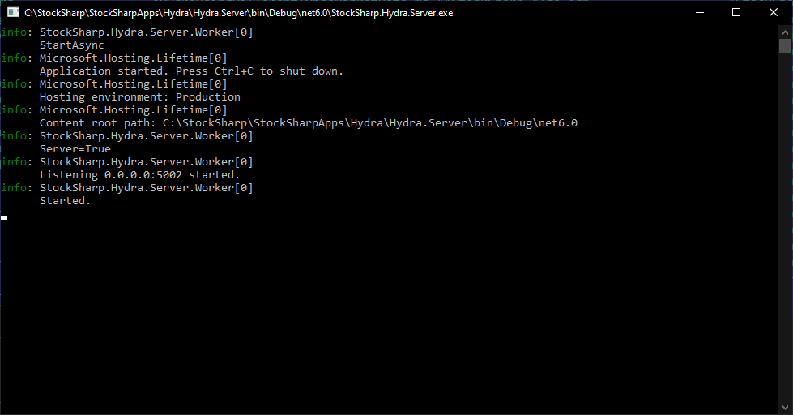

# Servidor Hydra

**Hydra Server** es un servicio que transmite datos por la red para que programas externos, como [Designer](designer.md), puedan conectarse a él.

A diferencia del [modo servidor](hydra/server_mode/settings.md), **Hydra Server** es un programa multiplataforma separado, hecho como aplicación de consola, y puede ejecutarse en servidores Windows o Linux.

> [!TIP]
> En Windows, Hydra Server puede registrarse como Windows Service e iniciarse automáticamente al arrancar el sistema. Para obtener más información, consulte [Windows service](https://en.wikipedia.org/wiki/Windows_service).

**Hydra Server** usa la misma configuración que [Hydra](hydra.md). Para la configuración inicial, ejecute primero [Hydra](hydra.md) y después use la configuración creada por Hydra Server.



El programa tiene un archivo de configuración `appsettings.json`:

```json
{
	"Logging": {
		"LogLevel": {
			"Default": "Information",
			"Microsoft.Hosting.Lifetime": "Information"
		}
	},
	"Server": {
		"WebApiAddress": "api.stocksharp.com/v1/",
		"LogLevel": "Inherit",
		"AutoDownload": false,
		"CompanyPath": "",
		"AppDataPath": ""
	}
}

```

- **WebApiAddress** - dirección de StockSharp WebAPI. Se usa para la administración mediante [Telegram](telegram_services.md).
- **LogLevel** - nivel de logging.
- **AutoDownload** - indica si se debe habilitar la descarga automática de fuentes al iniciar.
- **CompanyPath** - si se usa el programa como Windows Service, debe establecer la ruta como "C:\\Users\\%user_name%\\Documents\\StockSharp".
- **AppDataPath** - si se mueve el directorio de configuración de [Hydra](hydra.md), debe especificarse una nueva ruta a la configuración.
