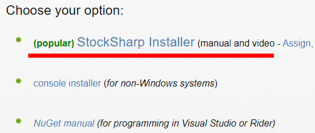
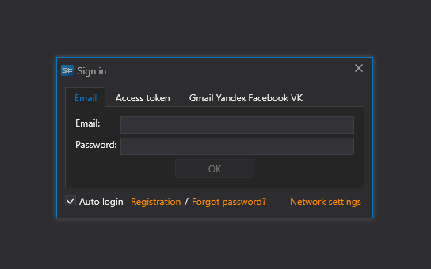

# Primer inicio

1. Para instalar [Installer](../installer.md), vaya a la página [Download](https://stocksharp.com/products/download/):
   
    

2. Descargue la distribución de [Installer](../installer.md).
3. Ejecute el archivo de instalación **stocksharp_setup.exe** y siga las instrucciones del instalador.
4. A veces Windows no inicia la instalación inmediatamente y muestra una advertencia:

   

5. En este caso, haga clic en el enlace **More info** en la ventana de advertencia, después de lo cual aparecerá la siguiente ventana:

    

    Al hacer clic en el botón **Run anyway**, se inicia la instalación de [Installer](../installer.md).

6. Después [Installer](../installer.md) se desempaquetará. Espere a que finalice el proceso.
7. Durante el primer inicio debe introducir su login y contraseña de **StockSharp**.

    

    Puede iniciar sesión introduciendo sus credenciales directamente o mediante autorización de una red social. Si se registró en el sitio de StockSharp mediante una red social, no tendrá contraseña.

8. Después de iniciar sesión, se abrirá la ventana del programa:

**Ver el [tutorial en video](videos/setup.md)**

## Véase también

[Instalación y eliminación de programas](install_and_remove_apps.md)
