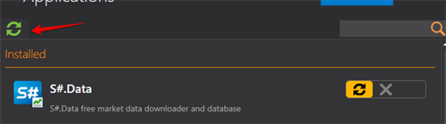

# Actualizar aplicaciones

[Installer](../installer.md) realiza el seguimiento de todas las actualizaciones de software y se actualiza automáticamente. Por lo tanto, no es necesario desinstalarlo después de la instalación.

Para comprobar manualmente si hay actualizaciones disponibles, debe hacer clic en el botón **Actualizaciones** en la esquina derecha de la ventana del programa.

Si hay actualizaciones disponibles para el programa, [Installer](../installer.md) se lo notificará.

Después debe hacer clic en el botón.

[Installer](../installer.md) no se cierra haciendo clic en **"X"** en la ventana del programa, sino mediante la barra de herramientas.

Para ello, abra el menú con clic derecho y haga clic en **Cerrar**.

**Ver [tutorial en video](videos/update_apps.md)**.

## Contenido recomendado

[Instalar y eliminar aplicaciones](install_and_remove_apps.md)
