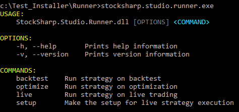

# Línea de comandos

**Runner**, al ser una aplicación de consola, ofrece la posibilidad de iniciarse en distintos modos especificando parámetros en la línea de comandos. Al iniciar el programa sin parámetros, se mostrará un mensaje de ayuda con los parámetros disponibles:



Inicio de **Runner** para pruebas sobre datos históricos:

```cmd
b -s SmaStrategy.cs -h "C:\Storage" --hf 20200401 --ht 20200430 --sec AAPL@NASDAQ -r json
```

Parámetros disponibles:

- -s - ruta al archivo de estrategia (con extensión cs, json o dll).
- -t - (opcional) si se selecciona un archivo dll y el ensamblado contiene más de una clase de estrategia, debe especificar el tipo requerido mediante este parámetro.
- -h - ruta al directorio con datos históricos. Puede ser una dirección de red en caso de usar modo servidor [server](../hydra_server.md).
- --hl - (opcional) login, usado en modo servidor [server](../hydra_server.md).
- --hp - (opcional) contraseña, usada en modo servidor [server](../hydra_server.md).
- --hf - fecha de inicio para pruebas en formato YYYYMMDD.
- --ht - fecha de finalización para pruebas en formato YYYYMMDD.
- -f - (opcional) formato de almacenamiento (Binary o Csv).
- --sec - (opcional) [Identificador de instrumento](../api/instruments/instrument_identifier.md).
- -r - (opcional) formato del informe de resultado de prueba (json, xml, csv).
- --tm - (opcional) timeout de la estrategia.
- --memory - (opcional) tamaño máximo de memoria (en megabytes).
- --cpu - (opcional) máscara del procesador.
- -l - (opcional) nivel de logging (Info, Debug, Error, Warning, Verbose).

Inicio de **Runner** para optimización:

```cmd
o -s SmaStrategy.cs -h "C:\Storage" --hf 20200401 --ht 20200430 --sec AAPL@NASDAQ -r json -p sma_optimization.json
```
Todos los parámetros del modo de pruebas históricas, más parámetros adicionales:

- -p - ruta al archivo de parámetros.
- --ol - (opcional) número máximo de iteraciones.
- --ob - (opcional) número de estrategias probadas simultáneamente.

Formato del archivo de parámetros:

```json
[
	{
	"Name": "SMA_80",
	"Value": "200,201"
	},
	{
	"Name": "SMA_30",
	"From": "40",
	"To": "50",
	"Step": "1"
	},
	{
	"Name": "Security",
	"Value": "AAPL@NASDAQ,MSFT@NASDAQ"
	}
]
```

Inicio de **Runner** para trading real:

```cmd
l -s SmaStrategy.cs -c connector.json --tg telegram.json
```

- -c - archivo de configuración de conexión.
- --tg - archivo de configuración de integración con Telegram.
