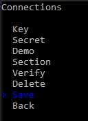

# Configuración de conexión

**Runner**, además de [exportar configuración desde Designer](export_from_designer.md), ofrece la posibilidad de configurar el programa mediante su interfaz de consola. Para ello, debe ejecutar el programa con el comando **setup**:

```cmd
stocksharp.studio.runner setup
```

Aparecerá un menú:


Al seleccionar el elemento Connections, el programa entrará en el modo de configuración del conector:


Aquí puede editar una conexión guardada anteriormente o crear una nueva:


Después de seleccionar el tipo requerido de nueva conexión, el programa pasará al menú de edición de su configuración:


Para [Binance](../api/connectors/crypto_exchanges/binance.md), debe introducir su configuración principal:


Para verificar la corrección de los datos introducidos, seleccione **Check**:


Se iniciará la comprobación de conexión:


En caso de éxito, se mostrará un mensaje:


Después de introducir todos los ajustes y verificarlos, debe pulsar **Save**:



En la carpeta Data se creará un archivo **connector.json** (si no se había creado antes), que contendrá la configuración guardada.

Para configurar la integración con [Telegram](../telegram_services.md), seleccione el elemento de menú:


Y autentíquese con un método conveniente:


Para autenticación por token, introduzca el token de [https://stocksharp.ru/profile/](https://stocksharp.ru/profile/):


En caso de éxito, el programa mostrará las opciones disponibles de operación con Telegram:


