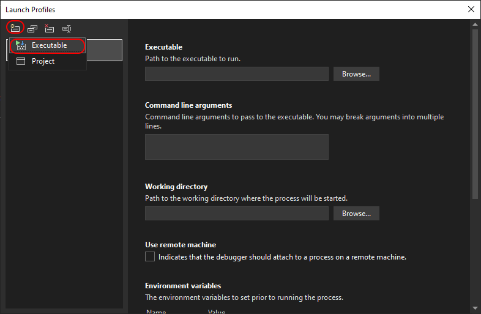

# Integración con Visual Studio

**Runner** puede usarse como medio para depurar estrategias de forma similar a [Designer](../designer/strategies/using_dll/debug_dll_in_visual_studio.md). Esto es conveniente si se planea ejecutar la estrategia solo en **Runner**. En caso contrario, es más cómodo lanzar y trabajar con la estrategia dentro del programa [Designer](../designer.md).

Para configurar el proceso de depuración, deben realizarse los siguientes pasos:

1. Haga clic derecho en el proyecto de estrategia de trading y seleccione **Properties** en el menú contextual:


En la pestaña que aparece, busque el elemento **Debug**, seleccione la sección **General** y haga clic en **Open debug launch profiles UI**.

2. Después, en la ventana que se abre, cree un nuevo perfil de depuración con el lanzamiento de un programa externo:



3. Introduzca la ruta completa a **Runner** y especifique los parámetros de línea de comandos para el lanzamiento. Más información sobre la [línea de comandos de Runner](command_line.md).


Argumentos de línea de comandos para el ejemplo:

```cmd
l -s "$(TargetPath)" -c "C:\StockSharp\Runner\Data\connection.json" --sec BTCUSDT_PERPETUAL@BNB --pf Binance_-298049655_Futures
```

$(TargetPath) - es una macro especial de **Visual Studio** que se sustituye automáticamente por la ruta a la DLL compilada con la estrategia durante el inicio de depuración.

4. Cierre la ventana de configuración del proyecto e inicie la depuración del proyecto (por ejemplo, mediante F5). Aparecerá la ventana del programa **Runner**, mostrando el proceso de conexión de trading:


5. Al establecer puntos de interrupción, la ejecución del programa se detendrá al alcanzarlos. Por ejemplo, para depurar la lógica de trading cuando aparece una nueva vela:


