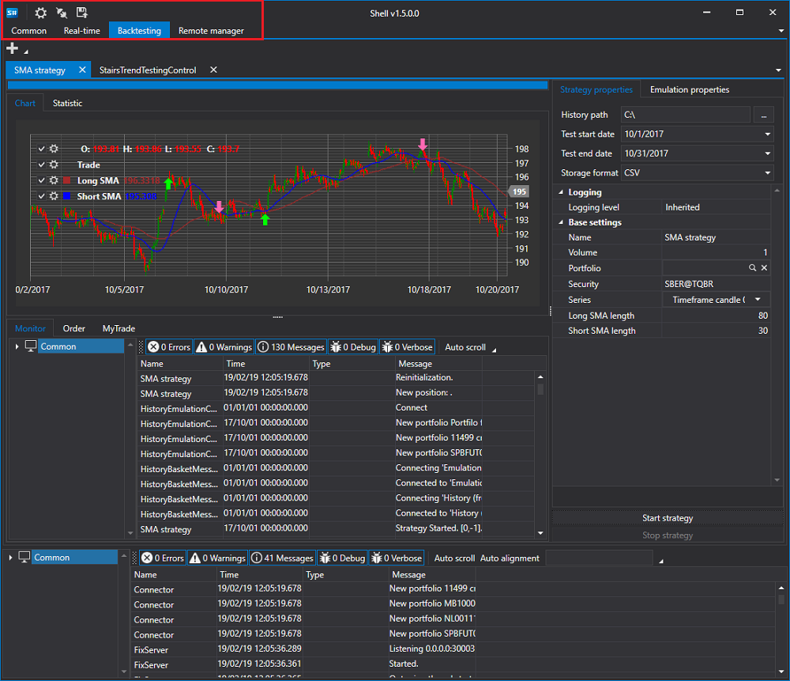

# Inicio rápido

[Shell](../shell.md) está orientado a la programación en lenguaje [C#](https://en.wikipedia.org/wiki/C_Sharp_(programming_language)) en el entorno Visual Studio o similar.

Al iniciar el proyecto [Shell](../shell.md), Solution Explorer muestra el proyecto Shell:

La carpeta **Estrategias** contiene tres estrategias incluidas en [Shell](../shell.md), un shell para estrategias predeterminadas y algunas interfaces auxiliares.

El proyecto se puede iniciar sin preparación previa para ver cómo funciona con las estrategias ya incluidas en [Shell](../shell.md).

Después del inicio veremos una ventana como esta:

La configuración de conexión y los botones de conexión, así como el botón de guardado para la configuración actual de Shell, se encuentran en la parte superior de la pantalla. Las pestañas principales también se encuentran allí.

Vaya a la configuración de conexión y seleccione la conexión necesaria. Cómo configurar una conexión se describe en [Configuración de conexiones](connections_settings.md).

El siguiente paso es conectarse haciendo clic en el botón **Conectar** .

Después de conectarse, en la pestaña [Común](user_interface/common.md), puede ver las carteras, instrumentos, órdenes y operaciones propias recibidas desde la conexión.

Vaya a la pestaña Tiempo real y haga clic en el botón **Añadir**  para añadir una estrategia para trading.

Una vez añadida la estrategia, rellene sus parámetros básicos, como **Instrumento**, **Cartera**, etc. Haga clic en el botón Iniciar estrategia para lanzarla.

De forma similar a la pestaña [Tiempo real](user_interface/real_time.md), puede ejecutar una prueba de estrategia sobre datos históricos en la pestaña [Emulación](user_interface/emulation.md).

