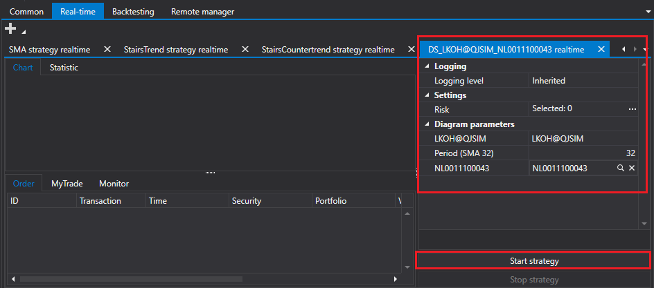

# Ejecutar estrategias desde Designer

[Shell](../shell.md) puede ejecutar estrategias creadas en [Designer](../designer.md).

Para lanzar una estrategia creada en [Designer](../designer.md), selecciónela en la pestaña [Tiempo real](user_interface/real_time.md) y haga clic en el botón **Añadir estrategia de Designer**. En la ventana que aparece, elija el archivo de estrategia exportado desde [Designer](../designer.md).

Después aparecerá en la lista de estrategias disponibles.

Al seleccionar la estrategia añadida, puede establecer los parámetros necesarios y lanzarla para trading.

## Contenido recomendado

[Crear estrategia](create_strategy.md)
