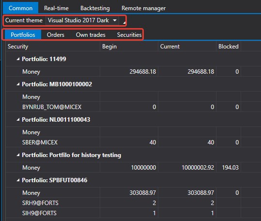

# Común

La pestaña **Común** permite ver información general sobre carteras, órdenes, operaciones e instrumentos. Aquí también puede establecer el tema de la interfaz de [Shell](../../shell.md).

En la pestaña **Instrumentos**, puede cargar instrumentos desde el almacenamiento local y modificar la configuración de instrumentos.

## Contenido recomendado

[Tiempo real](real_time.md)
