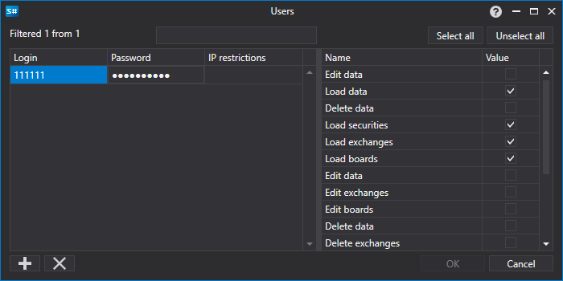
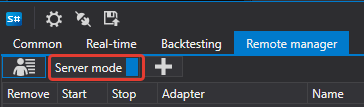
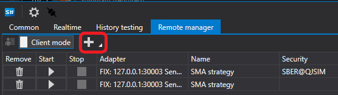

# RemoteManager

La pestaña **RemoteManager** permite habilitar el modo de control remoto. Para habilitar este modo, debe ir al menú de configuración de usuario.


En la ventana que aparece, establezca su **nombre de usuario** y **contraseña**.



Después debe habilitar el **modo servidor**.



Ahora puede conectarse a Shell desde otro Shell.

Para ello, debe ejecutar **otro Shell**. En él, vaya a la configuración de conexión.


En la ventana que se abre, configure la conexión FIX.


Después pulse el botón Conectar.


Al conectarse, todas las estrategias existentes en el servidor Shell estarán disponibles en el cliente Shell.


Al hacer clic en el botón Añadir, puede añadir otra estrategia para la negociación.



Como el cliente Shell admite múltiples servidores, al añadir una estrategia debe seleccionar el servidor a la izquierda. Todas las estrategias disponibles en el servidor aparecerán a la derecha.


Después de añadir una estrategia, aparecerá en la lista de estrategias.


Al seleccionar una estrategia, habrá pestañas a la derecha con la configuración de la estrategia, así como sus estadísticas.

Después de cambiar la configuración de la estrategia, asegúrese de hacer clic en el botón Aplicar cambios; de lo contrario, los cambios no se aplicarán a la estrategia.


Si la estrategia tiene un comando distinto de Start\/Stop, para aplicarlo debe establecerlo en el siguiente campo.


Y haga clic en el botón de enviar comando.

Para establecer su comando en la estrategia, debe sobrescribir el método [Strategy.ApplyCommand](xref:StockSharp.Algo.Strategies.Strategy.ApplyCommand(StockSharp.Messages.CommandMessage))**(**[StockSharp.Messages.CommandMessage](xref:StockSharp.Messages.CommandMessage) cmdMsg **)**.

```cs
public virtual void ApplyCommand(CommandMessage cmdMsg)

```

La clase base [Strategy](xref:StockSharp.Algo.Strategies.Strategy) solo controla el inicio y la detención de la estrategia.

## Contenido recomendado

[Configuración de conexiones](../connections_settings.md)
