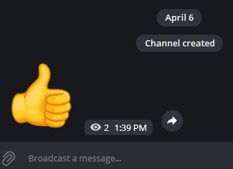
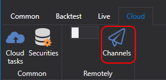
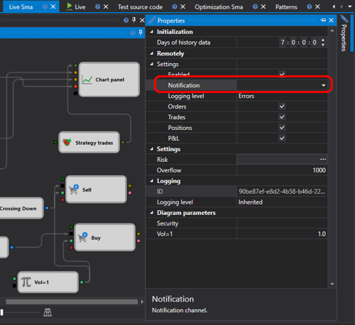

# Alertas

Servicio para enviar mensajes desde aplicaciones (como [Designer](../designer.md) o su propio programa personalizado) tanto a canales o grupos privados como públicos en Telegram.

Para configurar:

1. Complete el [proceso de autorización del bot](authorization.md).

2. Cree un canal o grupo (privado o público).

   
   

3. Añada el bot [StockSharpBot](https://t.me/StockSharpBot)

   

4. Hágalo administrador.

   

5. Permisos necesarios para el funcionamiento correcto.

   

6. Escriba la palabra especial **activate** en el canal o grupo.

   

7. Si todo va bien, recibirá una respuesta.

   

El canal que ha creado ya está disponible para sus estrategias y robots de negociación:

  - Al usar [Designer](../designer.md), haga clic en la lista de canales en el panel superior:

  

  En la ventana que aparece, verá listas de todos los canales y grupos donde ha activado el bot:

  

  Al pulsar el botón con el icono de Telegram se enviará un mensaje de prueba. Si se recibe, significa que todo está configurado correctamente.

  

  *En la tarifa gratuita se añade una línea mencionando el sitio StockSharp. En las tarifas de pago, esta línea se elimina.*

Si tiene varios canales de salida en Telegram y desea dirigir distintas estrategias a canales separados, puede especificar los canales para cada estrategia en la configuración:

- En otros programas, la configuración se realiza de forma similar a [Designer](../designer.md). Por ejemplo, en el programa [Hydra](../hydra.md), puede configurar el registro de errores de descarga de datos de mercado si [Hydra](../hydra.md) se encuentra en un servidor y necesita recibir rápidamente información sobre una conexión no funcional.
- En el caso de [Shell](../shell.md) o [S#](../api.md), puede ver el código que integra sus estrategias con el servicio Telegram.
