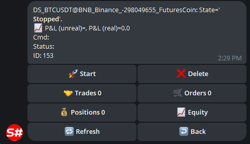

# Panel de control

Servicio para gestionar estrategias y robots de negociación mediante un bot de Telegram.

Para la configuración, complete previamente el [proceso de autorización del bot](authorization.md).

Después de esto, el bot está listo para usarse. A continuación, para que el bot empiece a ver sus estrategias, debe:

 - Al usar el programa [Designer](../designer.md), habilitar el modo remoto en el panel Nube:

  

  Todas las estrategias que se ejecutan en modo en vivo se transferirán automáticamente al bot de Telegram y podrá controlarlas desde su teléfono.

  En [StockSharpBot](https://t.me/StockSharpBot), seleccione el comando /apps para ver una lista de todos los programas:

  

  Después de seleccionar el programa deseado, podrá ver las estrategias y sus controles:

  

  

  

 - Al usar [Shell](../shell.md), vaya al panel RemoteManager y configure los ajustes de forma similar a [Designer](../designer.md).
 - Al usar [Hydra](../hydra.md), realice acciones similares a [Designer](../designer.md). La integración con [Hydra](../hydra.md) permite gestionar la descarga de datos de mercado y monitorizar estadísticas cuantitativas.

  
  

 - Al usar [S#](../api.md), puede integrarlo usando el código de [Shell](../shell.md). Gracias a que [S#](../api.md) es multiplataforma, sus robots pueden ejecutarse en cualquier sistema operativo.
