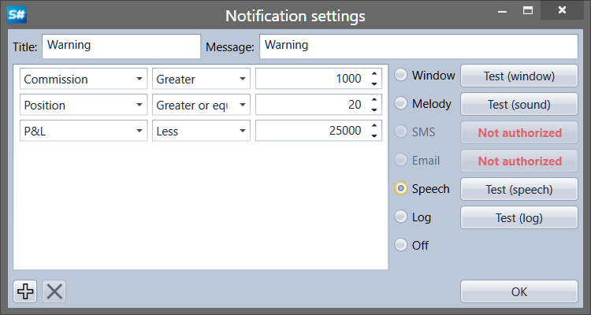

# Configuración de notificaciones

Para establecer una notificación, debe hacer clic en el botón  en el panel de notificaciones ([Panel de notificaciones](notification_panel.md)) o hacer clic en el botón  directamente en los paneles que admiten notificaciones ([Carteras](../user_interface/portfolios.md), [Feed de operaciones](../user_interface/components/trades_feed.md), [Noticias](../user_interface/components/news.md), [Level 1](../user_interface/components/level_1.md)).

Las notificaciones pueden configurarse para cambios en los siguientes tipos de datos: Portfolio, Customer code, Broker, Depository, Server time, Trade, Data type, Cancellation, Order ID, Order ID (string), Order ID (board), Derivative, Derivative (string), Price, Volume (order), Volume (trade), Visible volume, Direction, Remainder, Order type, Status, Comment, Message to order, System order, Order expiration time, Execution condition, Order ID, Order ID (string), Price, Trade initiator, Open interest, Error, Condition, Uptrend, Commission, Delay, Slippage, ID (user), Currency, P\/L, Position, Market Maker.

Las notificaciones pueden tener las siguientes formas:

- **Ventana** – aparecerá una pequeña ventana emergente con un mensaje en la esquina de la pantalla.
- **Melodía** – se reproducirá una melodía.
- **SMS** – se enviará un mensaje por SMS.
- **Email** – el mensaje se enviará por correo electrónico.
- **Voz** – el mensaje será pronunciado por una voz generada por ordenador.
- **Registro** – el mensaje se enviará a la ventana de logs de Designer.
- **Desactivado** – la notificación no se mostrará.
