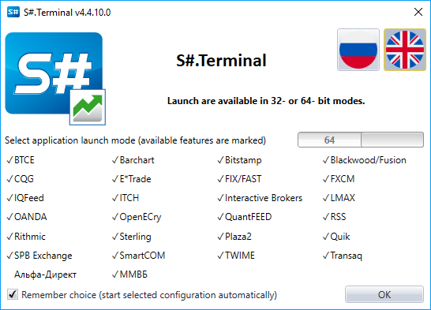
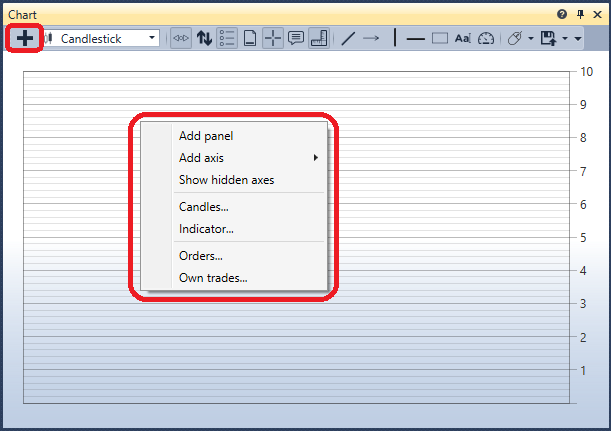
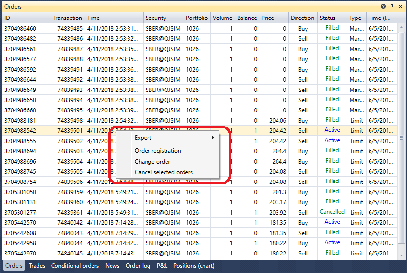

# Inicio rápido

Cuando inicia [Terminal](../terminal.md) por primera vez, se mostrará la siguiente ventana:

Debe seleccionar el modo de inicio y hacer clic en **OK**.

Después de seleccionar el modo de inicio, se abre la ventana del terminal con el conjunto predeterminado de componentes.

Vayamos a la configuración de conexión y seleccionemos la conexión requerida. Cómo configurar la conexión se describe en la sección [Configuración de conexión](connection_settings.md).

El siguiente paso es conectarse haciendo clic en el botón **Conectar** .

Al hacer clic en el botón **Añadir**  en el panel del gráfico, añadimos una nueva área de gráfico. Con clic derecho en el área del gráfico, añadimos velas para el instrumento que nos interesa. Podemos añadir indicadores, operaciones propias y órdenes al gráfico. También existe la posibilidad de registrar órdenes desde el gráfico. Para obtener más información sobre cómo trabajar con el gráfico, consulte la sección [Gráfico](user_interface/components/chart.md).

Al hacer clic en el botón **Añadir**  en el panel Instrumentos, se añaden los instrumentos que desea observar. Aquí se mostrarán los mejores datos de precio. Para obtener más información sobre cómo trabajar con el panel Instrumentos, consulte la sección [Instrumentos](user_interface/components/instruments.md).

En el libro de órdenes, después de hacer clic en el botón **Configuración** , aparece un panel donde puede especificar el **Instrumento** y la **Cartera** para las operaciones. Aquí también puede ajustar la profundidad del libro de órdenes. Para obtener más información sobre cómo trabajar con un libro de órdenes, consulte la sección [Libro de órdenes](user_interface/components/order_book.md).

Registremos las primeras órdenes. Las órdenes se pueden registrar haciendo clic en los botones **Comprar/Vender** o haciendo clic en las celdas de las columnas **Compra/Venta** del propio libro de órdenes. El panel de órdenes muestra todas sus órdenes. Al hacer clic derecho sobre una orden, verá un panel que permite enviar una nueva orden, cancelar o modificar la orden seleccionada. Para obtener más información sobre cómo trabajar con el panel de órdenes, consulte la sección [Órdenes](user_interface/components/orders.md).

En el panel Operaciones, puede ver operaciones por instrumentos. Para obtener más información sobre cómo trabajar con el panel Operaciones, consulte la sección [Operaciones](user_interface/components/trades.md).

Si es necesario, puede añadir componentes adicionales. Todos los componentes se describen en la sección [Componentes](user_interface/components.md).

