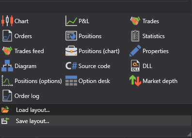

# Componentes

Durante el trading, puede necesitar controlar completamente el proceso. Para control y análisis completos, **Terminal** proporciona componentes gráficos que puede añadir seleccionándolos en el grupo **Components** de la **Ribbon**:

- [Instrumentos](components/instruments.md) - tabla con instrumentos que muestra información sobre todos los instrumentos seleccionados.
- [Level 1](components/level_1.md) - tabla con el historial de cambios de Level 1 para los instrumentos seleccionados.
- [Buy\/Sell](components/buy_sell.md) - grupo de paneles que muestra la mejor información de precio para los instrumentos seleccionados y permite comprar o vender el volumen requerido de esos instrumentos.
- [Libro de órdenes](components/order_book.md) - tabla de órdenes limitadas de compra y venta.
- [Gráfico](components/chart.md) - permite dibujar velas e indicadores para el instrumento seleccionado.
- [P&L equity](../../designer/user_interface/components/pnl_equity.md) - gráfico de Profit\/Loss (no realizado), Profit\/Loss (realizado) y comisión.
- [Operaciones](../../designer/user_interface/components/trades.md) - tabla con operaciones que muestra información completa sobre todas las operaciones de la estrategia.
- [Órdenes](../../designer/user_interface/components/orders.md) - tabla con órdenes que muestra información completa sobre todas las órdenes de la estrategia.
- [Órdenes condicionales](components/conditional_orders.md) - tabla con órdenes condicionales que muestra información completa sobre todas las órdenes condicionales de la estrategia.
- [Posiciones](../../designer/user_interface/components/positions.md) - tabla de la posición actual.
- [Operaciones tick](../../designer/user_interface/components/tick_trades.md) - tabla de operaciones que muestra información completa sobre todas las operaciones de los instrumentos seleccionados.
- [Posiciones](../../designer/user_interface/components/positions.md) - gráfico de la posición.
- [Noticias](components/news.md) - muestra noticias recibidas desde conexiones.
- [Posiciones (opciones)](components/positions_options.md) - representación gráfica de la posición por opciones.
- [Option desk](components/option_desk.md) - tabla de los principales parámetros de las opciones seleccionadas para el instrumento subyacente.
- [Smile volatility](components/smile_volatility.md) - representación gráfica del nivel esperado de volatilidad para opciones con el mismo activo subyacente y distintos strikes.
- [Registro de órdenes](components/order_log.md) - tabla con órdenes que muestra información completa sobre todas las órdenes de los instrumentos seleccionados.
